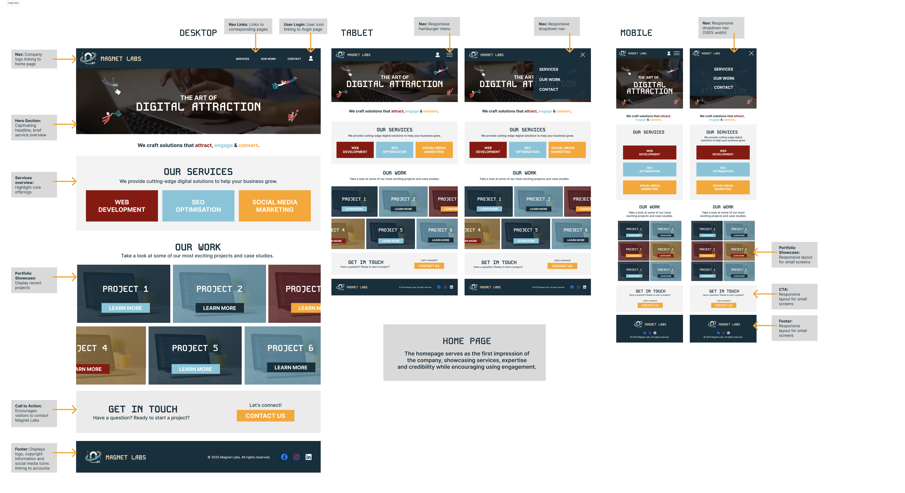

  

# Part A Submission

## Description of Website

### Purpose

Magnet Labs is a digital marketing and web development agency. This app will function as both a company website and a client portal. Clients will be able to manage their projects, receive updates, and submit feedback, while admins will have tools to oversee client accounts, publish announcements, and handle communications.

### Functionality/Features

Client Portal

- Login & Registration: Secure authentication with email verification and password reset.

- Onboarding & Profile Management: Clients input business details, goals, and update profiles.

- Project Updates & Announcements: Dashboard displays project status and company updates.

- Feedback & Suggestions: Clients submit feedback for admin review.

Admin Portal

- Client Management: View, update, and assist client profiles.

- Announcements & Content Management: Publish and manage updates.

- Feedback Management: Track and respond to client submissions.

- Role-Based Access Control (RBAC): Secure access for clients and admins.

### Target Audience

The target audience for Magnet Labs includes businesses and organizations seeking digital marketing expertise and web development services. These clients are typically looking for a comprehensive platform where they can manage their projects efficiently, offer feedback, and stay informed about new announcements and updates from the agency. Additionally, users include prospective clients interested in learning about Magnet Labs’ services and current clients wishing to track the progress of their ongoing projects.

### Tech Stack

#### **Front-end**

- HTML
- CSS
- [React](https://reactjs.org/)

#### **Back-end**

- [Express](https://expressjs.com/)
- [Node.js](https://nodejs.org/en/)

#### **Database**

- [MongoDB](https://www.mongodb.com/)
- [Mongoose](https://mongoosejs.com/)

#### **Deployment**

- [Vercel](https://vercel.com/)
- [Render](https://render.com/)

#### **Project Management**

- [Confluence](https://www.atlassian.com/software/confluence)
- [Jira](https://www.atlassian.com/software/jira)
- [Discord](https://discord.com/)

#### **Testing**

- [Jest](https://jestjs.io/)
- [Vitest](https://vitest.dev/)

#### **DevOps Tools**

- [git](https://git-scm.com/)
- [GitHub Actions](https://github.com/features/actions)

## Dataflow Diagram

## Application Architecture Diagram

## User Stories

### User Personas

## Our User Stories

### Summary of user Stories

| **Epic**                               | **User Story**                                                                                                                                        |
| -------------------------------------- | ----------------------------------------------------------------------------------------------------------------------------------------------------- |
| **Public-Facing Website**              | **As a visitor, I want a consistent navigation and footer across all pages**, so that I can easily explore the website.                               |
|                                        | **As a visitor, I want to view a welcoming homepage**, so that I can understand the company's mission and navigate to other sections easily.          |
|                                        | **As a visitor, I want to explore the 'Our Services' page**, so that I can learn about the various services offered by the company.                   |
|                                        | **As a visitor, I want to browse the 'Our Work' page**, so that I can see examples of the company's previous projects and assess their quality.       |
|                                        | **As a visitor, I want to view detailed information about specific projects**, so that I can gain insights into the company's expertise and approach. |
|                                        | **As a visitor, I want to access the 'Contact Us' page**, so that I can find ways to get in touch with the company for inquiries or collaborations.   |
| **User Authentication**                | **As a user, I want to register an account with my email and password**, so that I can access the platform securely.                                  |
|                                        | **As a user, I want to see a successful registration message**, so that I know my registration process worked.                                        |
|                                        | **(Stretch)** **As a user, I want to receive an email verification link after signing up**, so that I can confirm my identity.                        |
|                                        | **As a user, I want to log in using my email and password**, so that I can access my account.                                                         |
|                                        | **(Stretch)** **As a user, I want to reset my password via email**, so that I can regain access if I forget it.                                       |
|                                        | **(Stretch)** **As a security-conscious admin, I want login attempts to be rate-limited**, so that brute force attacks are prevented.                 |
| **Access Control & Permissions**       | **As an admin, I want to assign roles (client/admin) to users**, so that they have appropriate permissions.                                           |
|                                        | **As a user, I want to only see features relevant to my role**, so that I don’t access admin functionality.                                           |
|                                        | **(Stretch)** **As an admin, I want to revoke user access**, so that I can disable inactive or malicious accounts.                                    |
|                                        | **(Stretch)** **As an admin, I want session expiration and automatic logout after inactivity**, so that user security is maintained.                  |
| **Client Onboarding Form**             | **As a new user, I want to fill out an onboarding form with my business details**, so that I can personalize my profile.                              |
|                                        | **As a system admin, I want to validate required fields**, so that clients do not submit incomplete forms.                                            |
|                                        | **(Stretch)** **As an admin, I want to review and approve client onboarding details**, so that I can ensure accurate business information.            |
| **User Profile Management**            | **As a user, I want to update my personal and business information**, so that my profile remains accurate.                                            |
|                                        | **As a user, I want to change my password**, so that I can maintain account security.                                                                 |
|                                        | **As an admin, I want to edit client profiles**, so that I can assist with updates if needed.                                                         |
| **Feedback & Communication**           | **As a user, I want to submit feedback about my project**, so that I can share my concerns or suggestions.                                            |
|                                        | **As an admin, I want to receive and track client feedback**, so that I can address issues promptly.                                                  |
|                                        | **(Stretch)** **As an admin, I want to see past feedback submissions**, so that I can track responses.                                                |
| **User Dashboard (Client View)**       | **As a user, I want to see my active projects**, so that I can track progress.                                                                        |
|                                        | **(Stretch)** **As a user, I want to receive real-time notifications**, so that I stay updated on project changes.                                    |
|                                        | **(Stretch)** **As a user, I want a quick overview of my recent interactions**, so that I can stay informed.                                          |
| **Announcements & Content Management** | **As an admin, I want to create announcements**, so that I can share company updates with clients.                                                    |
|                                        | **As a user, I want to see announcements on my dashboard**, so that I stay informed.                                                                  |
|                                        | **(Stretch)** **As an admin, I want to schedule announcements**, so that I can plan content in advance.                                               |
| **Admin Dashboard (Admin View)**       | **As an admin, I want to view all client accounts**, so that I can manage them effectively.                                                           |
|                                        | **(Stretch)** As an admin, I want to reset passwords for users, so that I can assist in account recovery.                                             |
|                                        | **(Stretch)** **As an admin, I want to track open client issues**, so that I can prioritize problem resolution.                                       |
| **Reporting & Analytics** _(Stretch)_  | **As an admin, I want to see engagement metrics**, so that I can analyze platform usage.                                                              |
|                                        | **As an admin, I want to generate reports on project progress**, so that I can share updates with stakeholders.                                       |
|                                        | **As an admin, I want to track common feedback themes**, so that I can identify improvement areas.                                                    |
| **System Monitoring** _(Stretch)_      | **As an admin, I want to monitor uptime and performance metrics**, so that I can ensure system stability.                                             |
|                                        | **As an admin, I want to receive security alerts**, so that I can proactively address risks.                                                          |
| **User Task Management** _(Stretch)_   | **As a user, I want a Kanban board for my projects**, so that I can visualize progress.                                                               |
|                                        | **As an admin, I want to assign tasks to users**, so that I can track project phases.                                                                 |

## Sprint Planning and Task Management for T3A2 – Part B

#### Sprint Structure

For Part B of the T3A2 assignment, we implemented an Agile approach using JIRA to manage and track development tasks. The project was structured into three sprints, each with a one-week duration, ensuring an iterative and organized workflow. The first sprint began on February 12, 2025, at 7:00 PM.

- **Total Sprints: 3**
- **Sprint Duration: 1 week each**
- **Start Date of First Sprint: February 12, 2025, at 7:00 PM**

Each sprint focused on completing a subset of tasks, allowing for incremental progress and continuous testing.

#### Task Organization in JIRA

To maintain clarity and efficiency, tasks were categorized using JIRA’s hierarchical structure, which consists of Epics, User Stories, and Subtasks.

- **Epics:**
  An Epic represents a large feature or major functionality that is too big to be completed in a single sprint. Epics are divided into multiple user stories, allowing for better tracking and modular development.

- **User Stories**
  A User Story defines a specific feature or functionality from an end-user perspective. It is a smaller, more manageable work unit within an Epic. User stories help ensure that development aligns with user needs.

- **Subtasks**
  Each user story was broken into subtasks, categorized into six different functional areas:

| **Subtask Type**          | **Purpose**                                                           |
| ------------------------- | --------------------------------------------------------------------- |
| **Frontend Subtask**      | Implement UI components and client-side logic                         |
| **Backend Subtasks**      | Develop API endpoints, databases, and server-side logic               |
| **Security Subtask**      | Implement authentication, authorization, and data protection measures |
| **Testing Subtask**       | Perform unit, integration, and end-to-end testing                     |
| **Deployment Subtask**    | Manage deployment and CI/CD pipeline tasks                            |
| **Documentation Subtask** | Write API documentation, project reports, and user guides             |

⚠ Note: Not all subtasks were necessary for every user story. Tasks were assigned based on the specific requirements of each story.

#### JIRA Task Hierarchy

```mermaid
graph TD;
    A[📌 Epic] --> B[📍 User Story]
    B --> C1[🖥️ Frontend Subtask]
    B --> C2[⚙️ **Backend Subtasks**]
    B --> C3[🔒 Security Subtask]
    B --> C4[🧪 **Testing Subtask**]
    B --> C5[🚀 Deployment Subtask]
    B --> C6[📖 Documentation Subtask]
```

### Detailed Breakdown of User Stories, Epics and tasks

### Epics

For this project, we categorized our chosen Epics into two groups:

- **MVP (Core Features)** – These are the essential features required to meet the project's baseline functionality. The primary focus of our sprints was to complete these first.
- **Stretch Goals (Post-MVP)** – These are additional features that enhance the user experience but are not critical for the initial version. These were considered only after the core features were completed.
  This approach ensured that we prioritized delivering the most important functionality before working on secondary enhancements. Below, we outline the Epics along with their descriptions and purpose in the project.

#### MVP (Core Features)

1. **Setup & Environment Configuration**
   - Setting up repositories, environments (Dev, Staging, Prod), CI/CD pipelines, and database initialization
2. **Documentation**
   - For internal documentation like updating readme, confluence
   - Creating diagrams, guide, test plans etc
3. **Public-Facing Website**
   - Landing Page, About Us, Our Services, Case Studies, Testimonials, Contact Us.
   - Branding elements (logo, color scheme, typography).
   - Content writing for service pages, blogs, and metadata.
4. **User Authentication**
   - Implement secure login and registration.
   - Email verification and password reset functionality.
5. **Access Control & Permissions**
   - Role-Based Access Control (RBAC) for clients and admins.
   - Secure session management and access restrictions.
6. **Client Onboarding form**
   - Guided process for new clients to set up their accounts.
   - Collect business details and goals during onboarding.
7. **User Profile Management**
   - Allow clients to update personal and business information.
   - Manage account settings and preferences.
8. **Feedback & Communication**
   - Clients submit feedback on projects.
   - Admins review, respond, and track feedback history.
9. **User Dashboard (Client View)**
   - Display active projects, status updates, and recent changes.
   - Provide real-time notifications for clients.
10. **Announcements & Content Management**
    - Admins create and publish company updates.
    - Manage visibility and scheduling of announcements.
11. **Admin Dashboard (Admin View)**
    - View and update client accounts.
    - Assist with troubleshooting and profile updates.

#### Stretch Goals (Post-MVP)

1. **Reporting & Analytics** _(Stretch Goal)_
   - Track key engagement metrics and project activity.
   - Generate admin reports for decision-making.
2. **System Monitoring** _(Stretch Goal)_

   - Monitor uptime, SEO score, and domain expiry.
   - Issue security alerts for SSL and other risks.

3. **User Task management** _(Stretch Goal)_
   - Implement a Kanban board for project tracking.
   - Enable task creation, assignment, and progress tracking.

## User Stories

### Epic: Public-Facing Website

### 1. **As a visitor, I want a consistent navigation and footer across all pages**, so that I can easily explore the website.

\***\*Frontend Subtasks\*\***

- Design and implement a **sticky responsive navbar**.
- Include **logo, navigation links, and call-to-action buttons** (e.g., Contact Us).
- Ensure **active page highlighting** in the navbar.
- Implement **mobile-friendly navigation** (hamburger menu).
- Design and develop a **site-wide footer** with:
- Social media links
- Quick navigation links
- Contact details (if applicable)
- Develop reusable components for:
- **Buttons** (primary, secondary, CTA buttons).
- **Page section containers** (e.g., uniform padding, section dividers).
- **Typography styles** (headings, paragraphs).

**Testing Subtask**

1. Verify **navbar and footer display correctly** across all pages.
2. Test **mobile responsiveness** (expand/collapse navbar, ensure footer adjusts properly).
3. Ensure **CTA buttons work and direct to the correct pages**.

4. **As a visitor, I want to view a welcoming homepage**, so that I can understand the company's mission and navigate to other sections easily

**Frontend Subtasks**

- Design and develop the **homepage UI** with sections (hero banner, company mission, teaser sections for services, work, and contact).
- Implement a **responsive layout** that works on mobile and desktop.

**Testing Subtask**

- Ensure homepage sections **display correctly** across all devices.
- Test **navigation links** to services, work, and contact pages.

### 2. **As a visitor, I want to explore the 'Our Services' pag**e, so that I can learn about the various services offered by the company.

**Frontend Subtasks**

- Develop the **Our Services page layout** with distinct sections for each service.
- Implement **service cards or collapsible sections** for readability.

**Testing Subtask**

- Verify **content formatting** and correct display of services.
- Ensure **navigation to service details (if applicable)** is working.

### 3. **As a visitor, I want to browse the 'Our Work' page**, so that I can see examples of the company's previous projects and assess their quality.

**Frontend Subtasks**

- Develop the **Our Work page layout** showcasing past projects.
- Implement **project thumbnails with hover effects or modal previews**.

**Testing Subtask**

- Ensure **all project images load properly** and are responsive.
- Test **navigation to detailed project pages**.

### 4. **As a visitor, I want to view detailed information about specific projects**, so that I can gain insights into the company's expertise and approach.

**Frontend Subtasks**

- Build the **Project Detail Page UI** with structured sections

**Testing Subtask**

- Ensure **project details display correctly** across devices.
- Test **navigation from the Our Work page to individual projects**.

### 5. **As a visitor, I want to access the 'Contact Us' page**, so that I can find ways to get in touch with the company for inquiries or collaborations.

**Frontend Subtasks**

- Design and implement **Contact Us page layout**.
- Add a **contact form** (name, email, message).
- Include **business email, phone number, and address**

**Testing Subtask**

- Verify **form submissions work** and messages are delivered.
- Ensure **all contact methods (email, phone) display correctly**.

### Epic: User Authentication

### 1. **As a user, I want to register an account with my email and password,** so that I can access the platform securely.

**Frontend Subtasks**

- Build registration form UI (email, password fields)
- Implement client-side validation (email format, password strength)
- Display success message on successful registration.Connect form to backend API (send data on submit)

**Database Subtask**

- Create `users` table with fields: `id, email, password_hash, created_at, role`
- Ensure email is unique (add constraints)
- Write Schemas for `users` table

**Backend Subtasks**

- Create `POST /register` API endpoint.
- Validate user input (email format, password constraints)
- Hash password securely before storing in DB
- Return appropriate success/error response

**Testing Subtask**

- Write unit tests for user registration API
- Test frontend validation with various inputs.
- Ensure database constraints work (unique email test).

### 2. **As a user, I want to see a successful registration message,** so that I know my registration process worked.

**Frontend Subtasks**

- If necessary have a loading message if registration takes time
- Display success/fail message on successful registration.

**Backend Subtasks**

- Ensure API returns a success/failure response (eg: `201 Created` or equivalent).

**Testing Subtask**

- Write unit test to verify frontend displays the success message correctly.
- Test API response to ensure it returns success message properly.
- Check UI behavior when success message is shown

1. [**Stretch?**] **As a user, I want to receive an email verification link after signing up,** so that I can confirm my identity.
2. **As a user, I want to log in using my email and password,** so that I can access my account.

**Frontend Subtasks**

- Build login form UI (email & password fields). Should be a version of the registration form.
- Handle API response (successful login redirects to dashboard, errors display messages).
- Store authentication token securely (e.g., localStorage or sessionStorage).

**Backend Subtasks**

- Create `POST /login` API endpoint.
- Validate user credentials (check email & password against database).
- Return appropriate error messages for failed login attempts (wrong password, unverified email, etc.).

**Database Subtask**

- Query the `users` table to verify email exists.
- Ensure password hashing comparison works correctly.

**Testing Subtask**

- Write unit tests for login API.
- Test login flow in frontend with valid and invalid credentials.
- Verify security measures (rate-limiting, invalid login lockout).

### 3. [**Stretch?**] As a user, I want to reset my password via email, so that I can regain access if I forget it.

### 4. [**Stretch?**] **As a security-conscious admin, I want login attempts to be rate-limited,** so that brute force attacks are prevented.

### Epic: Access Control & Permissions

### 1. **As an admin, I want to assign roles (client/admin) to users,** so that they have appropriate permissions.

**Frontend Subtasks**

- Add role selection UI for admins (dropdown or toggle).
- Implement role-based UI updates (disable/enable features based on role).

**Backend Subtasks**

- Implement Role-Based Access Control (RBAC) logic in backend.
- Create `PATCH /users/:id/role` API endpoint to update roles.
- Ensure only admins can assign or modify roles.

**Testing Subtask**

- Write unit tests for role assignment API.
- Verify that non-admin users **cannot** modify roles.
- Check that role-based permissions are enforced (e.g., clients cannot access admin dashboard).

### 2. **As a user, I want to only see features relevant to my role,** so that I don’t access admin functionality.

**Frontend Subtask**

- Implement role-based UI rendering (hide/show elements based on user role).
- Ensure navigation bar dynamically updates based on role (e.g., clients don’t see admin links).

**Backend Subtasks**

- Implement role-based API access control (deny unauthorized API calls).
- Ensure unauthorized users receive proper **403 Forbidden** responses when attempting admin actions.

**Testing Subtask**

- Test UI for correct feature visibility based on user roles.
- Ensure clients **cannot** see or access admin features.
- Verify unauthorized API requests return correct error responses (`403 Forbidden`).

### 3. [**Stretch?**] **As an admin, I want to revoke user access,** so that I can disable inactive or malicious accounts.

### 4. [**Stretch?**] **As an admin, I want session expiration and automatic logout after inactivity,** so that user security is maintained.

### Epic: Client Onboarding Form

### 1. **As a new user, I want to fill out an onboarding form with my business details,** so that I can personalize my profile.

**Testing Subtask**

- Test frontend form validation (empty fields, invalid formats).
- Verify API correctly saves business details and handles invalid data.
- Ensure database constraints are enforced (e.g., unique business emails).

**Database Subtask**

- Add fields to store business-related details in the **users** table _(or create a separate_ `business_details` _table if modularity is needed)._
- Ensure indexing and constraints for unique fields (e.g., email, website).
- Write appropriate Schemas

**Backend Subtasks**

- Create API endpoint `POST /users/:id/onboarding` to receive and store business details.
- Validate incoming data (e.g., prevent empty or invalid inputs).
- Store business details in the **users** table or a separate **business_details** table if needed.
- Return success or error response based on the validation.
  **Frontend Subtasks**

- Design and implement the onboarding form UI.
- Include fields such as **business name, industry, website, phone number, address, etc.**
- Implement client-side validation (e.g., required fields, proper email/phone format).
- Display a confirmation message after successful form submission.

### 2. **As a system admin, I want to validate required fields,** so that clients do not submit incomplete forms.

**Testing Subtasks**

- Create a **validation test suite** to check required fields across multiple forms.
- Verify that API validation logic correctly rejects incomplete submissions.

**Backend Subtasks**

- Implement a **centralized validation module** to enforce required fields for all API endpoints
- Ensure all API responses return a standardized validation error format.

**Frontend Subtasks**

- Ensure required field validation is applied consistently across all forms (registration, onboarding, profile updates, project submissions, etc.).
- Standardize frontend validation logic to avoid duplicating rules in multiple places.

### 3. [**Stretch?**] **As an admin, I want to review and approve client onboarding details,** so that I can ensure accurate business information.

### Epic: User Profile Management

### 1. **As a user, I want to update my personal and business information,** so that my profile remains accurate.

**Frontend Subtasks**

- Build a **Profile Edit UI** for users to update their personal and business details.
- Implement **inline validation** for required fields (e.g., email format, phone number).
- Display **confirmation message** after successful updates.

**Backend Subtasks**

- Create `PATCH /users/:id/profile` API endpoint for personal details updates.
- Create `PATCH /business/:id` API endpoint for business details updates _(if business info is stored separately)_.
- Validate input before updating the database.
- Ensure only **authenticated users** can modify their own details.

**Database Subtask**

- Ensure that updates reflect in the `users` and `business_details` tables.
- Apply constraints to prevent invalid data entries.

**Testing Subtask**

- Test frontend validation (empty fields, incorrect formats).
- Verify API correctly updates user profile and business details.
- Ensure **role-based restrictions** (only users should edit their own data).

### 2. **As a user, I want to change my password,** so that I can maintain account security.

**Frontend Subtasks**

- Implement **Change Password UI** (current password, new password, confirm new password fields).
- Validate **password strength** (e.g., minimum length, special characters).
- Show appropriate **success/error messages**.

**Backend Subtasks**

- Create `PATCH /users/:id/password` API endpoint.
- Verify the **current password** before allowing an update.
- Hash and securely store the **new password**.
- Send back confirmation message

**Testing Subtask**

- Test **frontend validation** (password strength, matching confirmation).
- Test **API response** for incorrect current password.
- Test **successful password change workflow**.-

### 3. **As an admin, I want to edit client profiles,** so that I can assist with updates if needed.

**Frontend Subtasks**

- Add an **Admin Profile Management UI** with a client search/filter function.
- Display **editable fields** for admins to update client details.
- Ensure **role-based UI rendering** (admins only).

**Backend Subtasks**

- Extend `PATCH /users/:id/profile` API to allow admin updates.
- Ensure **audit logging** of admin-made changes.
- Return **admin-friendly error messages** (e.g., when updating restricted fields).

**Testing Subtask**

- Verify that **admins can update client profiles** but **clients cannot update other users' profiles**.
- Ensure all **changes are logged** in the database.
- Test **error handling** (e.g., trying to edit non-existent users).

### Epic: Feedback & Communication

### 1. **As a user, I want to submit feedback about my project,** so that I can share my concerns or suggestions.

**Frontend Subtasks**

- Design and implement a **Feedback Submission UI** within the project dashboard.
- Include a **text input box** with character limit & validation (e.g., no empty submissions).
- Display **confirmation message** upon successful submission.

**Backend Subtasks**

- Create `POST /projects/:id/feedback` API endpoint.
- Validate input (ensure feedback is not empty).
- Store feedback in a **feedback** table linked to `projects` and `users`.
- Return appropriate success/error messages.

**Database Subtask**

- Create a `feedback` table with appropriate fields:
- Ensure foreign key constraints (users can only submit feedback on projects they belong to).

**Testing Subtask**

- Test **frontend validation** (empty input, character limits).
- Verify **backend validation** (non-existent projects, unauthorized users).
- Ensure feedback is **stored correctly in the database**.
- Test **rate-limiting to prevent spam**.

### 2. **As an admin, I want to receive and track client feedback,** so that I can address issues promptly.

**Frontend Subtasks**

- Design and implement a **Feedback Management UI** in the admin dashboard.
- Display **feedback list with filtering options** (e.g., by project, client, status).
- Implement a **status update feature** (e.g., Open, In Progress, Resolved).

**Backend Subtasks**

- Extend `GET /feedback` API to **return feedback with filters** (by project, status, client).
- Create `PATCH /feedback/:id/status` API to allow admins to update feedback status.
- Ensure admins can **respond to feedback** (if needed).

**Testing Subtask**

- Test **feedback retrieval** (ensure correct filters apply).
- Verify **only admins can update feedback status**.
- Test **admin responses are stored and displayed correctly**.

### 3. [**Stretch?**] **As a admin, I want to see past feedback submissions,** so that I can track responses.

### Epic : User Dashboard (Client View)

### 1. **As a user, I want to see my active projects,** so that I can track progress.

**Frontend Subtasks**

- Design and implement a **Projects Dashboard UI** in the user portal.
- Display **list of active projects** (with relevant details like status, due dates).
- Include a **filter/search option** (e.g., by project type, completion status).

**Backend Subtasks**

- Create `GET /users/:id/projects` API endpoint to return **only the user’s projects**.
- Ensure API supports **filtering and sorting** (e.g., by status, start date).

**Testing Subtask**

- Test API to **return only projects belonging to the logged-in user**.
- Verify that **filters work correctly** (e.g., active vs. completed projects).
- Test UI to **ensure correct project details are displayed**.

### 2. [**Stretch?**] **As a user, I want to receive real-time notifications,** so that I stay updated on project changes.

### 3. [**Stretch?**] **As a user, I want a quick overview of my recent interactions,** so that I can stay informed.

### Epic: Announcements & Content Management

### 1. **As an admin, I want to create announcements,** so that I can share company updates with clients.

**Frontend Subtasks**

- Design and implement an **Admin Announcement Management UI**.
- Include a **rich text editor** for writing announcements.
- Display a **preview feature** before publishing.
- Show list of past announcements with **edit and delete options**.

**Backend Subtasks**

- Create `POST /announcements` API endpoint to allow admins to **create new announcements**.
- Create `GET /announcements` API endpoint for retrieving announcements for users.
- Implement `PATCH /announcements/:id` to allow **editing** existing announcements.
- Implement `DELETE /announcements/:id` to allow **deletion**.

**Database Subtask**s

- Create `announcements` table with appropriate fields:
- Ensure **timestamps and author tracking** are enabled.

**Testing Subtask**

- Test **UI functionality** (creating, editing, deleting announcements).
- Verify API correctly **stores and retrieves announcements**.
- Ensure **unauthorized users cannot create/edit/delete announcements**.

### 2. **As a user, I want to see announcements on my dashboard,** so that I stay informed.

**Frontend Subtasks**

- Implement **Announcements Section** on the user dashboard.
- Display announcements in **reverse chronological order** (latest first).
- Style announcements with **title, content, and timestamp**.
- Show a "Read More" option if an announcement is too long.

**Backend Subtasks**

- Extend `GET /announcements` API to return **only active announcements**.
- Allow filtering (e.g., **limit results to the last 5 announcements** for dashboard display).

**Testing Subtask**

- Verify **announcements display correctly** on the dashboard.
- Test API returns **only active announcements**.
- Ensure UI handles **long announcements properly**.

1. [**Stretch?**] **As an admin, I want to schedule announcements,** so that I can plan content in advance.

### Epic : Admin Dashboard (Admin View)

### 1. **As an admin, I want to view all client accounts,** so that I can manage them effectively.

**Frontend Subtasks**

- Design and implement a **Client Management UI** in the admin panel.
- Display **list of all client accounts** with details (name, email, business name, account status).
- Add **search & filter options** (by name, email, role, registration date).

**Backend Subtasks**

- Create `GET /clients` API endpoint to return a **paginated list of client accounts**.
- Allow **filtering by account status, role, and registration date**.

**Testing Subtask**

- Verify that **only admins can view client accounts**.
- Ensure API **returns correct filtered results**.
- Test UI **pagination, search, and filtering**.

### 2. [**Stretch?**] **As an admin, I want to reset passwords for users,** so that I can assist in account recovery.

### 3. [**Stretch?**] **As an admin, I want to track open client issues,** so that I can prioritize problem resolution.

## Stretch Goals (Post-MVP)

### Epic: Reporting & Analytics

### 1. **As an admin, I want to see engagement metrics,** so that I can analyze platform usage.

### 2. **As an admin, I want to generate reports on project progress,** so that I can share updates with stakeholders.

### 3. **As an admin, I want to track common feedback themes,** so that I can identify improvement areas.

### **Epic: System Monitoring**

### 1. **As an admin, I want to monitor uptime and performance metrics,** so that I can ensure system stability.

### 2. **As an admin, I want to receive security alerts,** so that I can proactively address risks.

### **Epic: User Task Management (Kanban Board)**

### 1. **As a user, I want a Kanban board for my projects,** so that I can visualize progress.

### 2. **As an admin, I want to assign tasks to users,** so that I can track project phases.

## Wireframes

Each wireframe image contains a desktop, tablet and mobile view. Some pages will also show hamburger menu open.

### Home Page

### Services Page

### Our Work Page

### Project Page (Colour Scheme 1)

### Project Page (Colour Scheme 2)

### Contact Page

### Admin Login Page

### Admin Dashboard

### Client Login Page

### Client Dashboard

## Kanban Screenshots
We decided to use a simple Kanban board instead of sprints for Part A because we’re in the discovery phase, where requirements are still evolving. Sprints work best when tasks are well-defined and time-boxed, but since we need flexibility to adapt as we learn more, Kanban makes more sense. It allows us to visualise our workflow, track progress, and adjust priorities as needed without being restricted by rigid sprint cycles. This way, we can keep things moving efficiently while staying open to changes.

#### Screenshot 1

#### Screenshot 2

#### Screenshot 3

#### Screenshot 4

#### Screenshot 5

#### Screenshot 6

#### Screenshot 7

#### Screenshot 8
