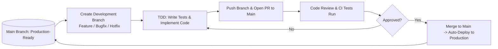

<p align="center">
  
</p>

# Full Stack Application (Part B)

## Project Overview

Our Full Stack Application (Part B) is designed to meet the requirements of a real-world client. The application demonstrates our ability to design a scalable architecture, implement robust features using MERN technologies, and deploy the solution on a cloud platform. This project builds on the planning completed in Part A, and it is developed in a collaborative group environment.

## Project Structure

We decided to go with a monolithic repository structure for this project instead of a decoupled setup. A monolithic repository means all the project’s code, including the frontend, backend, shared utilities, and documentation, is stored in a single repository rather than split across multiple ones. This makes it easier to manage everything in one place. For example, if a change impacts both the API and the user interface, it can be handled in a single commit rather than coordinating across separate repositories.

Given our small team size, tight deadlines, and the need for ease of testing and deployment, this approach is more practical. It simplifies dependency management, testing, and the CI/CD process, allowing us to work more efficiently.

```plaintext
/                          # Root directory
├── .github/               # GitHub-specific files (Actions, Workflows, etc.)
│   └── workflows/         # CI/CD pipeline configurations
│       └── ci.yml         # GitHub Actions workflow configuration
│
├── backend/               # Backend server code
│   ├── node_modules/      # Backend dependencies
│   └── src/               # Source code for backend
│       ├── controllers/   # Route controllers
│       ├── middlewares/   # Custom middleware functions
│       ├── models/        # Database models (Schemas)
│       ├── routes/        # Application routes
│       ├── services/      # Business logic/services
│       └── tests/         # Unit and integration tests
│   ├── .env               # Environment variables
│   ├── index.js           # Backend entry point
│   ├── server.js          # Server configuration
│   ├── package.json       # Backend dependencies and scripts
│   ├── package-lock.json  # Exact versions of dependencies
│   └── vitest.config.js   # Vitest testing configuration
│
├── frontend/              # Frontend React application
│   ├── coverage/          # Code coverage reports
│   ├── node_modules/      # Frontend dependencies
│   ├── public/            # Public assets (HTML, static files, etc.)
│   └── src/               # Source code for frontend
│       ├── assets/        # Static assets like images, fonts, etc.
│       ├── components/    # Reusable UI components
│       ├── hooks/         # Custom React hooks
│       ├── pages/         # Main app pages (routes/screens)
│       ├── tests/         # Unit and integration tests
│       └── utils/         # Utility functions and helper methods
│       ├── App.css        # App-wide CSS styles
│       ├── App.jsx        # Main React component
│       ├── index.css      # Global CSS
│       ├── main.jsx       # Frontend entry point
│   ├── .env               # Frontend environment variables
│   ├── .gitignore         # Files/folders ignored by Git
│   ├── eslint.config.js   # ESLint configuration for code linting
│   ├── index.html         # Main HTML entry file for the app
│   ├── package.json       # Frontend dependencies and scripts
│   ├── package-lock.json  # Dependency lock file
│   └── README.md          # Frontend-specific documentation
│
├── PartASubmission/       # Files related to Part A submission
│   ├── docs/              # Supplementary documentation (images, PDFs, diagrams)
│   └── README.md          # Comprehensive documentation for Part A
│
├── PartBSubmission/       # Files related to Part B submission
│   ├── docs/              # Supplementary documentation (images, PDFs, diagrams)
│   └── README.md          # Comprehensive documentation for Part B
│
├── .gitignore             # Specifies files to ignore in version control
├── LICENSE                # License information
```

## Technologies

**Technologies:**

- **Frontend:**
- **Backend:**
- **Database:**
- **Others:**

---

## Project Management

### Source control

We utilized Github as our source control system to track changes, manage branches.

We decided to use a [trunk-based development](https://www.atlassian.com/continuous-delivery/continuous-integration/trunk-based-development) workflow, using only main as our primary branch. All new features or fixes branch off from main and merge back once reviewed and tested. This approach reduces overhead and keeps our release cycle nimble.

#### Branching Strategy



##### 1. `main` Branch

- **Production-Ready Code**: Serves as the single source of truth for stable, production-ready code.
- **Stable & Verified**: All changes must be merged via **Pull Requests (PRs)** that have passed code reviews and automated tests.
- **Auto-Deployment**: Upon successful merge into `main`, the CI/CD pipeline automatically deploys changes to the production or a hosted environment.

##### 2. Development Branches (Feature, Bugfix, Hotfix)

All development work,whether adding features, fixing bugs, or handling urgent patches—will follow a unified workflow. Instead of maintaining separate branch types, we’ll use specific naming conventions to differentiate between tasks.

#### Purpose

- Add new features, fix bugs, or handle urgent production issues without directly affecting the stability of the `main` branch.

##### Branch From: `main`

##### Merge Into: `main` (via Pull Request)

---

### Agile Methodology

Lorem ipsum dolor sit amet, consectetur adipiscing elit, sed do eiusmod tempor incididunt ut labore et dolore magna aliqua. Ut enim ad minim veniam, quis nostrud exercitation ullamco laboris nisi ut aliquip ex ea commodo consequat. Duis aute irure dolor in reprehenderit in voluptate velit esse cillum dolore eu fugiat nulla pariatur. Excepteur sint occaecat cupidatat non proident, sunt in culpa qui officia deserunt mollit anim id est laborum.

### Project Management Tool: JIRA

Lorem ipsum dolor sit amet, consectetur adipiscing elit, sed do eiusmod tempor incididunt ut labore et dolore magna aliqua. Ut enim ad minim veniam, quis nostrud exercitation ullamco laboris nisi ut aliquip ex ea commodo consequat. Duis aute irure dolor in reprehenderit in voluptate velit esse cillum dolore eu fugiat nulla pariatur. Excepteur sint occaecat cupidatat non proident, sunt in culpa qui officia deserunt mollit anim id est laborum.

##### Tickets

Lorem ipsum dolor sit amet, consectetur adipiscing elit, sed do eiusmod tempor incididunt ut labore et dolore magna aliqua. Ut enim ad minim veniam, quis nostrud exercitation ullamco laboris nisi ut aliquip ex ea commodo consequat. Duis aute irure dolor in reprehenderit in voluptate velit esse cillum dolore eu fugiat nulla pariatur. Excepteur sint occaecat cupidatat non proident, sunt in culpa qui officia deserunt mollit anim id est laborum.

##### Task Delegation Methodology

Lorem ipsum dolor sit amet, consectetur adipiscing elit, sed do eiusmod tempor incididunt ut labore et dolore magna aliqua. Ut enim ad minim veniam, quis nostrud exercitation ullamco laboris nisi ut aliquip ex ea commodo consequat. Duis aute irure dolor in reprehenderit in voluptate velit esse cillum dolore eu fugiat nulla pariatur. Excepteur sint occaecat cupidatat non proident, sunt in culpa qui officia deserunt mollit anim id est laborum.

##### Project Management Board Screenshots

Lorem ipsum dolor sit amet, consectetur adipiscing elit, sed do eiusmod tempor incididunt ut labore et dolore magna aliqua. Ut enim ad minim veniam, quis nostrud exercitation ullamco laboris nisi ut aliquip ex ea commodo consequat. Duis aute irure dolor in reprehenderit in voluptate velit esse cillum dolore eu fugiat nulla pariatur. Excepteur sint occaecat cupidatat non proident, sunt in culpa qui officia deserunt mollit anim id est laborum.

---

## Testing

### Testing Methodology (TDD)

### Development Testing

##### Testing using Vitest

##### Automated Testing using Github Actions

### Production Testing

##### Testing plan

---

## Challenges

#### Challenge 1

##### Problem Resolution

Throughout the project, our team encountered several challenges which provided valuable learning opportunities.

## Presentation

T
