<p align="center">
  
</p>

# Full Stack Application (Part B)

## Project Overview

Our Full Stack Application (Part B) is designed to meet the requirements of a real-world client. The application demonstrates our ability to design a scalable architecture, implement robust features using MERN technologies, and deploy the solution on a cloud platform. This project builds on the planning completed in Part A, and it is developed in a collaborative group environment.

## Project Structure

We decided to go with a monolithic repository structure for this project instead of a decoupled setup. A monolithic repository means all the project’s code, including the frontend, backend, shared utilities, and documentation, is stored in a single repository rather than split across multiple ones. This makes it easier to manage everything in one place. For example, if a change impacts both the API and the user interface, it can be handled in a single commit rather than coordinating across separate repositories.

Given our small team size, tight deadlines, and the need for ease of testing and deployment, this approach is more practical. It simplifies dependency management, testing, and the CI/CD process, allowing us to work more efficiently.

```plaintext
/                          # Root directory
├── .github/               # GitHub-specific files (Actions, Workflows, etc.)
│   └── workflows/         # CI/CD pipeline configurations
│       └── ci.yml         # GitHub Actions workflow configuration
│
├── backend/               # Backend server code
│   ├── node_modules/      # Backend dependencies
│   └── src/               # Source code for backend
│       ├── controllers/   # Route controllers
│       ├── middlewares/   # Custom middleware functions
│       ├── models/        # Database models (Schemas)
│       ├── routes/        # Application routes
│       ├── services/      # Business logic/services
│       └── tests/         # Unit and integration tests
│   ├── .env               # Environment variables
│   ├── index.js           # Backend entry point
│   ├── server.js          # Server configuration
│   ├── package.json       # Backend dependencies and scripts
│   ├── package-lock.json  # Exact versions of dependencies
│   └── vitest.config.js   # Vitest testing configuration
│
├── frontend/              # Frontend React application
│   ├── coverage/          # Code coverage reports
│   ├── node_modules/      # Frontend dependencies
│   ├── public/            # Public assets (HTML, static files, etc.)
│   └── src/               # Source code for frontend
│       ├── assets/        # Static assets like images, fonts, etc.
│       ├── components/    # Reusable UI components
│       ├── hooks/         # Custom React hooks
│       ├── pages/         # Main app pages (routes/screens)
│       ├── tests/         # Unit and integration tests
│       └── utils/         # Utility functions and helper methods
│       ├── App.css        # App-wide CSS styles
│       ├── App.jsx        # Main React component
│       ├── index.css      # Global CSS
│       ├── main.jsx       # Frontend entry point
│   ├── .env               # Frontend environment variables
│   ├── .gitignore         # Files/folders ignored by Git
│   ├── eslint.config.js   # ESLint configuration for code linting
│   ├── index.html         # Main HTML entry file for the app
│   ├── package.json       # Frontend dependencies and scripts
│   ├── package-lock.json  # Dependency lock file
│   └── README.md          # Frontend-specific documentation
│
├── PartASubmission/       # Files related to Part A submission
│   ├── docs/              # Supplementary documentation (images, PDFs, diagrams)
│   └── README.md          # Comprehensive documentation for Part A
│
├── PartBSubmission/       # Files related to Part B submission
│   ├── docs/              # Supplementary documentation (images, PDFs, diagrams)
│   └── README.md          # Comprehensive documentation for Part B
│
├── .gitignore             # Specifies files to ignore in version control
├── LICENSE                # License information
```

## Technologies

**Technologies:**

- **Frontend:**
- **Backend:**
- **Database:**
- **Others:**

## Setup Instructions

---

## Project Management

### Source control

We utilized Github as our source control system to track changes, manage branches.

We decided to use a [trunk-based development](https://www.atlassian.com/continuous-delivery/continuous-integration/trunk-based-development) workflow, using only main as our primary branch. All new features or fixes branch off from main and merge back once reviewed and tested. This approach reduces overhead and keeps our release cycle nimble.

##### Branching Strategy


##### 1. `main` Branch

- **Production-Ready Code**: Serves as the single source of truth for stable, production-ready code.
- **Stable & Verified**: All changes must be merged via **Pull Requests (PRs)** that have passed code reviews and automated tests.
- **Auto-Deployment**: Upon successful merge into `main`, the CI/CD pipeline automatically deploys changes to the production or a hosted environment.

##### 2. Development Branches (Feature, Bugfix, Hotfix)

All development work,whether adding features, fixing bugs, or handling urgent patches will follow a unified workflow. Instead of maintaining separate branch types, we’ll use specific naming conventions to differentiate between tasks.

##### Purpose

- Add new features, fix bugs, or handle urgent production issues without directly affecting the stability of the `main` branch.

##### Branch From: `main`

##### Merge Into: `main` (via Pull Request)

### **Project Management Tool: JIRA**

#### JIRA Sprint Project

For this project we used Agile methodology with a sprint board to plan and track our progress. We worked in iterations, prioritizing key features, tackling tasks in sprints, and adapting based on feedback. This kept development structured and efficient.

#### **Backlog**

- **Purpose:**  
  Holds all incoming ideas, feature requests, and bugs not yet scheduled.  
  Items here aren’t necessarily ready to start; they might need more requirements or prioritization.

- **How We Use It:**  
  Product Owner (or Lead Dev) refines these items, clarifies requirements, and decides whether they’re ready for the next sprint.

### **Our Sprint Board Columns**

Below is the typical flow for tasks during a sprint:

#### **Selected for Development**

- **Purpose:**  
  Contains tasks that are prioritized and ready to be worked on.  
  Once we agree an item is good to go, we drag it from Backlog to Selected for Development.

- **How We Use It:**  
  When a dev is ready to pick up a new task, they pull from Selected for Development.  
  Make sure you have a clear acceptance criteria and story points assigned before moving on.

#### **In Progress**

- **Purpose:**  
  The developer is actively working on the ticket. This includes writing tests (TDD), coding the solution, and performing local checks.

- **Key Activities:**

  - Create a **Feature Branch** from main. For branching strategies, refer to the article **Git Workflow for the Team**.
  - **TDD:** Write unit tests (and integration tests if needed) before implementing the code. For TDD guidelines, refer to the **TDD Guidelines** article.
  - Commit frequently and keep your branch updated.
  - Once you have finished coding the component, move the ticket to the next status **Code Review (PR)** and open a pull request on GitHub.

- **How We Use It:**
  - Drag your ticket to **In Progress** when you start coding.
  - Keep your ticket here until the feature is fully coded and tested locally.

#### **Code Review (PR)**

- **Purpose:**  
  A Pull Request (PR) has been opened, and the code is under review by at least one other teammate.  
  CI tests automatically run on the PR to verify code quality and coverage.

- **Key Activities:**

  - Open PR against **main** once you’re happy with local tests.
  - Teammate(s) review your code for logic, style, and test coverage.
  - Address feedback, push changes until all reviewers approve and tests pass.

- **How We Use It:**
  - Move the ticket to **Code Review (PR)** as soon as your PR is up.
  - Once approved and merged, it moves on to the next column.

#### **UA/Prod Testing**

- **Purpose:**

  - Merging to **main** triggers an automatic deployment to our hosted environment.
  - **User Acceptance Testing (UAT):** Team members, stakeholders, or real users test the feature in a live (or staging) environment.
  - **Production Validation:** We confirm that the feature works in production.

- **What If Issues Arise?**
  - We simply drag the ticket back to **In Progress** if bugs pop up or client feedback requires changes.
  - We fix the code, create a new PR, and iterate until everything is solid.

##### **Done (“Released” / “Live”)**

- **Purpose:**

  - When testing in UAT & Production confirms everything is stable, mark the ticket as **Done**.

- **How We Use It:**
  - To mark work has been completed.

A screenshot of the different columns has been provided below.


#### Sprint Workflow and Execution

For this project, we structured our development process using sprints, following Agile methodology to ensure steady progress and adaptability. Each sprint was carefully planned, tracked, and reviewed to optimize efficiency and collaboration.

##### Sprint Planning

Before each sprint, we held a Sprint Planning Meeting to define the scope of work. During this meeting, we:

- Selected tasks based on estimated story points and team capacity.
- Assigned responsibilities to team members.
- Identified potential blockers and dependencies.
- Broke down complex tasks into subtasks to improve clarity and execution.

The goal was always to complete 100% of the planned tasks within the sprint. However, when certain tasks couldn't be completed within the sprint timeframe, in-progress tickets were moved to the next sprint to ensure continuity

##### Daily Stand-ups and Progress Tracking

During the sprint, we conducted daily stand-up posts, where each team member shared:

- What they worked on the previous day.
- What they planned to work on that day.
- Any blockers or challenges they were facing.

To visually track progress, we maintained a **burn-up chart**, which helped us monitor completed tasks against the total sprint goal. Additionally, daily screenshots of the Sprint Board were taken to document task movements across different workflow stages. However, in some cases, screenshots may be missing as tasks moved before we had a chance to capture them.

#### Task Organization in JIRA

##### Ticket Hierarchy

To maintain clarity and efficiency, tasks were categorized using JIRA’s hierarchical structure, which consists of **Epics**, **User Stories**, and **Subtasks**.

- **Epics:**
  An Epic represents a large feature or major functionality that is too big to be completed in a single sprint. Epics are divided into multiple user stories, allowing for better tracking and modular development.

- **User Stories**
  A User Story defines a specific feature or functionality from an end-user perspective. It is a smaller, more manageable work unit within an Epic. User stories help ensure that development aligns with user needs.

- **Subtasks**
  Each user story was broken into subtasks, categorized into six different functional areas:

```mermaid
graph TD;
    A[📌 Epic] --> B[📍 User Story]
    B --> C1[🖥️ Frontend Subtask]
    B --> C2[⚙️Backend Subtasks]
    B --> C3[🔒 Security Subtask]
    B --> C4[🧪 Testing Subtask]
    B --> C5[🚀 Deployment Subtask]
    B --> C6[📖 Documentation Subtask]
```



##### Story points

For task estimation, we assigned story points using the Fibonacci sequence (1, 2, 3, 5, 8, 13, etc.), which helped us capture the relative complexity and effort required for each task. This approach allowed us to differentiate between small, straightforward tasks and larger, more complex ones while avoiding false precision.

We based our estimations on several key factors:

- **Complexity:** How difficult is the task from a technical perspective? Does it require research or new implementations?
- Uncertainty:\*\* Are there unknowns that might require additional investigation or trial and error?
- **Effort:** How much coding, testing, and debugging time will be needed?
- **Dependencies:** Does the task rely on other features or third-party integrations?

For example, a simple UI adjustment might be assigned 1 or 2 story points, while a new feature requiring database changes, backend integrations, and testing could be 5 or more. The exponential nature of the Fibonacci sequence helped us avoid underestimating large tasks and encouraged discussions during sprint planning to ensure fair distribution of workload.

##### Priority

We prioritized tasks based on bProject value, urgency, dependencies, and technical feasibility to ensure efficient sprint execution. Each task was assessed using the following criteria:

- **Critical Bugs & Blocking Issues:** Any issues that impacted core functionality or blocked other tasks were given the highest priority and addressed immediately.
- **High-Value Features:** Features that directly contributed to the core functionality of the application or provided significant value to users were prioritized over minor enhancements.
- **Dependencies:** Tasks that other features relied on were completed earlier in the sprint to prevent bottlenecks.
- **Effort vs. Impact:** If two tasks had similar priority but one required significantly less effort, we often tackled the quick wins first to keep momentum high.

On JIRA, we used the following priority levels to categorize our tasks:

- **Lowest** – Non-urgent improvements or minor UI tweaks.
- **Low** – Small enhancements or optimizations that didn’t block core functionality.
- **Medium** – Standard development tasks, including new features and non-critical bug fixes.
- **High** – Tasks that were important for the sprint’s success but not urgent enough to block other work.
- **Highest** – Critical bugs, urgent fixes, and blockers that needed immediate attention.

During **Sprint Planning**, we discussed priority as a team to ensure a balanced workload. While some priorities were pre-determined based on requirements, we remained flexible, adjusting priorities mid-sprint if blockers or new dependencies arose.

### Our Tickets

#### Sprint 1

- **Start Date:** 12th Feb 2025, 7:00 PM
- **End Date:** 19th Feb 2025, 7:00 PM
- **Duration:** **7 days**
- **Story Points Taken:** 29
- **Story Points Completed:** 22
- **Completion Rate:** **~75.9%**

###### Ticket Table

| Status Report       | Sprint | Epic Name             | Epic Issue Key | Story Name                  | Story Issue Key | Story points | Subtask Name                                                                         | Subtask Type     | Subtask Issue Key | Priority | Assignee        |
| ------------------- | ------ | --------------------- | -------------- | --------------------------- | --------------- | ------------ | ------------------------------------------------------------------------------------ | ---------------- | ----------------- | -------- | --------------- |
| Completed Issues    | 1      | Public-Facing Website | TFS-14         | Website Navigation & Footer | TFS-25          | 2            |                                                                                      |                  |                   | Medium   | Mostofa         |
|                     |        |                       |                |                             |                 |              |                                                                                      |                  |                   |          |                 |
|                     |        |                       |                | Homepage UI                 | TFS-26          | 2            |                                                                                      |                  |                   |          |                 |
|                     |        |                       |                |                             |                 |              | Ensure CTA buttons work and direct to the correct pages.                             | Testing Subtask  | TFS-56            | Medium   | Perri Adkins    |
|                     |        |                       |                |                             |                 |              | Test mobile responsiveness (expand/collapse navbar, ensure footer adjusts properly). | Testing Subtask  | TFS-55            | Medium   | Perri Adkins    |
|                     |        |                       |                |                             |                 |              | Verify navbar and footer display correctly across all pages.                         | Testing Subtask  | TFS-54            | Medium   | Perri Adkins    |
|                     |        |                       |                |                             |                 |              | Develop reusable components for buttons, page containers                             | Frontend Subtask | TFS-53            | Medium   | Perri Adkins    |
|                     |        |                       |                |                             |                 |              | Design and develop a site-wide footer with social media links                        | Frontend Subtask | TFS-52            | Medium   | Perri Adkins    |
|                     |        |                       |                |                             |                 |              | Implement mobile-friendly navigation (hamburger menu)                                | Frontend Subtask | TFS-51            | Medium   | Perri Adkins    |
|                     |        |                       |                |                             |                 |              | Ensure active page highlighting in the navbar.                                       | Frontend Subtask | TFS-50            | Medium   | Perri Adkins    |
|                     |        |                       |                |                             |                 |              | Include logo, navigation links, and login icon                                       | Frontend Subtask | TFS-49            | Medium   | Perri Adkins    |
|                     |        |                       |                |                             |                 |              | Design and implement a sticky responsive navbar.                                     | Frontend Subtask | TFS-48            | Medium   | Perri Adkins    |
|                     |        |                       |                | Our Services Page           | TFS-27          | 2            |                                                                                      |                  |                   |          |                 |
|                     |        |                       |                |                             |                 |              | Implement service cards for readability.                                             | Frontend Subtask | TFS-113           | Medium   | Perri Adkins    |
|                     |        |                       |                |                             |                 |              | Develop the Our Services page layout with distinct sections for each service.        | Frontend Subtask | TFS-112           | Medium   | Perri Adkins    |
|                     |        |                       |                |                             |                 |              |                                                                                      |                  |                   |          |                 |
|                     |        |                       |                | Our Work Page               | TFS-28          | 2            | Implement project thumbnails with hover effects or modal previews.                   | Frontend Subtask | TFS-117           | Medium   | Perri Adkins    |
|                     |        |                       |                |                             |                 |              | Develop the Our Work page layout showcasing past projects.                           | Frontend Subtask | TFS-115           | Medium   | Perri Adkins    |
|                     |        |                       |                |                             |                 |              |                                                                                      |                  |                   |          |                 |
|                     |        |                       |                | Project Details Page        | TFS-29          | 2            |                                                                                      |                  |                   |          |                 |
|                     |        |                       |                |                             |                 |              | Build the Project Detail Page UI with structured sections                            | Frontend Subtask | TFS-118           | Medium   | Perri Adkins    |
|                     |        |                       |                |                             |                 |              |                                                                                      |                  |                   |          |                 |
|                     |        |                       |                |                             |                 |              |                                                                                      |                  |                   |          |                 |
| Removed from Sprint |        |                       |                | Contact Us Page             | TFS-30          | 2            |                                                                                      |                  |                   |          |                 |
|                     |        |                       |                |                             |                 |              | Design and implement Contact Us page layout.                                         | Frontend Subtask | TFS-111           | Medium   | Perri Adkins    |
|                     |        |                       |                |                             |                 |              | Add a contact form (name, email, message).                                           | Frontend Subtask | TFS-114           | Medium   | Perri Adkins    |
|                     |        |                       |                |                             |                 |              | Include business email, phone number, and address                                    | Frontend Subtask | TFS-116           | Medium   | Perri Adkins    |
|                     |        |                       |                |                             |                 |              |                                                                                      |                  |                   |          |                 |
|                     |        |                       |                | User Login                  | TFS-31          | 3            |                                                                                      |                  |                   |          |                 |
|                     |        |                       |                |                             |                 |              | Build login form UI (login screen)                                                   | Frontend Subtask | TFS-79            | Medium   | Trenton Dunstan |
|                     |        |                       |                |                             |                 |              | Handle API response (successful login, redirect)                                     | Frontend Subtask | TFS-80            | Medium   | Mostofa         |
|                     |        |                       |                |                             |                 |              | Store authentication token securely                                                  | Frontend Subtask | TFS-81            | Medium   | Mostofa         |
|                     |        |                       |                |                             |                 |              | Create POST /login API endpoint                                                      | Backend Subtask  | TFS-82            | High     | Mostofa         |
|                     |        |                       |                |                             |                 |              | Validate user credentials (check email & password)                                   | Backend Subtask  | TFS-83            | High     | Mostofa         |
|                     |        |                       |                |                             |                 |              | Return appropriate error messages for failed login attempts                          | Backend Subtask  | TFS-84            | High     | Mostofa         |
|                     |        |                       |                |                             |                 |              | Query the users table to verify email exists                                         | Database Subtask | TFS-85            | Medium   | Mostofa         |
|                     |        |                       |                |                             |                 |              | Ensure password hashing comparison works correctly                                   | Database Subtask | TFS-86            | Medium   | Mostofa         |
|                     |        |                       |                |                             |                 |              | Write unit tests for login API                                                       | Testing Subtask  | TFS-87            | Medium   | Mostofa         |
|                     |        |                       |                |                             |                 |              | Test login flow in frontend with valid/invalid credentials                           | Testing Subtask  | TFS-88            | Medium   | Trenton Dunstan |
|                     |        |                       |                |                             |                 |              | Verify security measures (rate-limiting, invalid login lockout)                      | Testing Subtask  | TFS-89            | Medium   | Mostofa         |
|                     |        |                       |                |                             |                 |              |                                                                                      |                  |                   |          |                 |
|                     |        |                       |                | Registration Confirmation   | TFS-32          | 3            |                                                                                      |                  |                   |          |                 |
|                     |        |                       |                |                             |                 |              | Ensure API returns a success/failure response (201 Created or eq.)                   | Backend Subtask  | TFS-72            | High     | Mostofa         |
|                     |        |                       |                |                             |                 |              | Write unit test to verify frontend displays the success message correctly            | Testing Subtask  | TFS-73            | Medium   | Perri Adkins    |
|                     |        |                       |                |                             |                 |              | Test API response to ensure it returns success message properly.                     | Testing Subtask  | TFS-74            | Medium   | Mostofa         |
|                     |        |                       |                |                             |                 |              | Check UI behavior when success message is shown                                      | Testing Subtask  | TFS-75            | Medium   | Trenton Dunstan |
|                     |        |                       |                |                             |                 |              |                                                                                      |                  |                   |          |                 |
|                     |        |                       |                | User Registration           | TFS-33          | 3            |                                                                                      |                  |                   |          |                 |
|                     |        |                       |                |                             |                 |              | Build registration form UI (email, password fields)                                  | Frontend Subtask | TFS-57            | Medium   | Trenton Dunstan |
|                     |        |                       |                |                             |                 |              | Implement client-side validation (email format, password strength)                   | Frontend Subtask | TFS-58            | Medium   | Trenton Dunstan |
|                     |        |                       |                |                             |                 |              | Display success message on successful registration                                   | Frontend Subtask | TFS-59            | Medium   | Trenton Dunstan |
|                     |        |                       |                |                             |                 |              | Create users table                                                                   | Database Subtask | TFS-60            | Medium   | Mostofa         |
|                     |        |                       |                |                             |                 |              | Write Schemas for users table                                                        | Database Subtask | TFS-62            | Medium   | Mostofa         |
|                     |        |                       |                |                             |                 |              | Create POST /register API endpoint                                                   | Backend Subtask  | TFS-63            | High     | Mostofa         |
|                     |        |                       |                |                             |                 |              | Validate user input (email format, password constraints)                             | Backend Subtask  | TFS-64            | High     | Mostofa         |
|                     |        |                       |                |                             |                 |              | Hash password securely before storing in DB                                          | Backend Subtask  | TFS-65            | High     | Mostofa         |
|                     |        |                       |                |                             |                 |              | Return appropriate success/error response                                            | Backend Subtask  | TFS-66            | High     | Mostofa         |
|                     |        |                       |                |                             |                 |              | Write unit tests for user registration API                                           | Testing Subtask  | TFS-67            | Medium   | Mostofa         |
|                     |        |                       |                |                             |                 |              | Test frontend validation with various inputs                                         | Testing Subtask  | TFS-68            | Medium   | Trenton Dunstan |
|                     |        |                       |                |                             |                 |              | Ensure database constraints work (unique email test)                                 | Database Subtask | TFS-69            | Medium   | Mostofa         |

#### **Sprint 1 Screenshots (12th Feb – 19th Feb)**

###### **Sprint 1 Start**


###### **Day 1 - End of Day (12th Feb)**


###### **Day 2 - End of Day (13th Feb)**


###### **Day 3 - End of Day (14th Feb)**


###### **Day 4 - End of Day (15th Feb)**


###### **Day 5 - End of Day (16th Feb)**


###### **Day 6 - End of Day (17th Feb)**


###### **Day 7 - End of Day (18th Feb)**


###### **Sprint 1 End**


###### **Sprint 1 Burnup Chart**


#### Sprint 2

- **Start Date:** 20th Feb 2025, 7:00 PM
- **End Date:** 2nd Mar 2025, 7:00 PM
- **Duration:** **11 days**
- **Story Points Taken:** 28
- **Story Points Completed:** 28
- **Completion Rate:** **100%**

###### Ticket Table

| Status Report       | Sprint | Epic Name               | Epic Issue Key | Story Name                              | Story Issue Key | Story points | Subtask Name                                                                                   | Subtask Type     | Subtask Issue Key | Priority | Assignee        |
| ------------------- | ------ | ----------------------- | -------------- | --------------------------------------- | --------------- | ------------ | ---------------------------------------------------------------------------------------------- | ---------------- | ----------------- | -------- | --------------- |
| Completed Issues    | 2      | Public-Facing Website   | TFS-14         |                                         |                 |              |                                                                                                |                  |                   |          |                 |
|                     |        |                         |                | Contact Us Page                         | TFS-30          | 2            |                                                                                                |                  |                   |          |                 |
|                     |        |                         |                |                                         |                 |              | Include business email, phone number, and address                                              | Frontend Subtask | TFS-116           | Medium   | Perri Adkins    |
|                     |        |                         |                |                                         |                 |              | Add a contact form (name, email, message).                                                     | Frontend Subtask | TFS-114           | Medium   | Perri Adkins    |
|                     |        |                         |                |                                         |                 |              | Design and implement Contact Us page layout.                                                   | Frontend Subtask | TFS-111           | Medium   | Perri Adkins    |
|                     |        |                         |                |                                         |                 |              |                                                                                                |                  |                   |          |                 |
|                     |        | User Authentication     | TFS-17         |                                         |                 |              |                                                                                                |                  |                   |          |                 |
|                     |        |                         |                | User Login                              | TFS-31          | 3            |                                                                                                |                  |                   |          |                 |
|                     |        |                         |                |                                         |                 |              | Verify security measures (rate-limiting, invalid login lockout).                               | Testing Subtask  | TFS-89            | Medium   | Mostofa         |
|                     |        |                         |                |                                         |                 |              | Test login flow in frontend with valid and invalid credentials.                                | Testing Subtask  | TFS-88            | Medium   | Trenton Dunstan |
|                     |        |                         |                |                                         |                 |              | Write unit tests for login API.                                                                | Testing Subtask  | TFS-87            | Medium   | Mostofa         |
|                     |        |                         |                |                                         |                 |              | Ensure password hashing comparison works correctly                                             | Database Subtask | TFS-86            | Medium   | Mostofa         |
|                     |        |                         |                |                                         |                 |              | Query the users table to verify email exists.                                                  | Database Subtask | TFS-85            | Medium   | Mostofa         |
|                     |        |                         |                |                                         |                 |              | Return appropriate error messages for failed login attempts                                    | Backend Subtask  | TFS-84            | High     | Mostofa         |
|                     |        |                         |                |                                         |                 |              | Validate user credentials (check email & password against database).                           | Backend Subtask  | TFS-83            | High     | Mostofa         |
|                     |        |                         |                |                                         |                 |              | Create POST /login API endpoint.                                                               | Backend Subtask  | TFS-82            | High     | Mostofa         |
|                     |        |                         |                |                                         |                 |              | Store authentication token securely                                                            | Frontend Subtask | TFS-81            | Medium   | Mostofa         |
|                     |        |                         |                |                                         |                 |              | Handle API response (successful login redirects to dashboard,                                  | Frontend Subtask | TFS-80            | Medium   | Mostofa         |
|                     |        |                         |                |                                         |                 |              | Build login form UI                                                                            | Frontend Subtask | TFS-79            | Medium   | Trenton Dunstan |
|                     |        |                         |                |                                         |                 |              |                                                                                                |                  |                   |          |                 |
|                     |        |                         |                | Registration Confirmation               | TFS-32          | 3            |                                                                                                |                  |                   |          |                 |
|                     |        |                         |                |                                         |                 |              | Check UI behavior when success message is shown                                                | Testing Subtask  | TFS-75            | Medium   | Trenton Dunstan |
|                     |        |                         |                |                                         |                 |              | Test API response to ensure it returns success message properly.                               | Testing Subtask  | TFS-74            | Medium   | Mostofa         |
|                     |        |                         |                |                                         |                 |              | Write unit test to verify frontend displays the success message correctly.                     | Testing Subtask  | TFS-73            | Medium   | Perri Adkins    |
|                     |        |                         |                |                                         |                 |              | Ensure API returns a success/failure response (eg: 201 Created or equivalent).                 | Backend Subtask  | TFS-72            | High     | Mostofa         |
|                     |        |                         |                |                                         |                 |              | Display success/fail message on successful registration.                                       | Frontend Subtask | TFS-71            | Medium   | Trenton Dunstan |
|                     |        |                         |                |                                         |                 |              | If necessary have a loading message if registration takes time                                 | Frontend Subtask | TFS-70            | Medium   | Trenton Dunstan |
|                     |        |                         |                |                                         |                 |              |                                                                                                |                  |                   |          |                 |
|                     |        |                         |                | User Registration                       | TFS-33          | 3            |                                                                                                |                  |                   |          |                 |
|                     |        |                         |                |                                         |                 |              | Connect UI form to backend                                                                     | Frontend Subtask | TFS-150           | Medium   | Mostofa         |
|                     |        |                         |                |                                         |                 |              | Ensure database constraints work (unique email test).                                          | Sub-task         | TFS-69            | Medium   | Mostofa         |
|                     |        |                         |                |                                         |                 |              | Test frontend validation with various inputs.                                                  | Testing Subtask  | TFS-68            | Medium   | Mostofa         |
|                     |        |                         |                |                                         |                 |              | Write unit tests for user registration API                                                     | Testing Subtask  | TFS-67            | Medium   | Mostofa         |
|                     |        |                         |                |                                         |                 |              | Return appropriate success/error response                                                      | Backend Subtask  | TFS-66            | High     | Mostofa         |
|                     |        |                         |                |                                         |                 |              | Hash password securely before storing in DB                                                    | Backend Subtask  | TFS-65            | High     | Mostofa         |
|                     |        |                         |                |                                         |                 |              | Validate user input (email format, password constraints)                                       | Backend Subtask  | TFS-64            | High     | Mostofa         |
|                     |        |                         |                |                                         |                 |              | Create POST /register API endpoint.                                                            | Backend Subtask  | TFS-63            | High     | Mostofa         |
|                     |        |                         |                |                                         |                 |              | Write Schemas for users table                                                                  | Database Subtask | TFS-62            | Medium   | Mostofa         |
|                     |        |                         |                |                                         |                 |              | Create users table                                                                             | Database Subtask | TFS-60            | Medium   | Mostofa         |
|                     |        |                         |                |                                         |                 |              | Display success message on successful registration                                             | Frontend Subtask | TFS-59            | Medium   | Mostofa         |
|                     |        |                         |                |                                         |                 |              | Implement client-side validation (email format, password strength)                             | Frontend Subtask | TFS-58            | Medium   | Mostofa         |
|                     |        |                         |                |                                         |                 |              | Build registration form UI (email, password fields)                                            | Frontend Subtask | TFS-57            | Medium   | Mostofa         |
|                     |        |                         |                |                                         |                 |              |                                                                                                |                  |                   |          |                 |
|                     |        |                         |                | Role-Based Access                       | TFS-34          | 5            |                                                                                                |                  |                   |          |                 |
|                     |        |                         |                |                                         |                 |              | Check that role-based permissions are enforced (e.g., clients cannot access admin dashboard).  | Testing Subtask  | TFS-97            | Medium   | Mostofa         |
|                     |        |                         |                |                                         |                 |              | Write unit tests for role assignment API.                                                      | Testing Subtask  | TFS-95            | Medium   | Trenton Dunstan |
|                     |        |                         |                |                                         |                 |              | Implement Role-Based Access Control (RBAC) logic in backend.                                   | Backend Subtask  | TFS-92            | High     | Mostofa         |
|                     |        |                         |                |                                         |                 |              | Implement role-based UI updates (disable/enable features based on role).                       | Frontend Subtask | TFS-91            | Medium   | Trenton Dunstan |
|                     |        |                         |                |                                         |                 |              | Add role selection UI for admins (dropdown or toggle).                                         | Frontend Subtask | TFS-90            | Medium   | Perri Adkins    |
|                     |        |                         |                |                                         |                 |              |                                                                                                |                  |                   |          |                 |
|                     |        |                         |                | Onboarding Form                         | TFS-36          | 3            |                                                                                                |                  |                   |          |                 |
|                     |        |                         |                |                                         |                 |              | Write integration test to check dataflow from backend to frontends expected.                   | Testing Subtask  | TFS-110           | Medium   | Mostofa         |
|                     |        |                         |                |                                         |                 |              | Ensure database constraints are enforced (e.g., unique business emails).                       | Testing Subtask  | TFS-109           | Medium   | Mostofa         |
|                     |        |                         |                |                                         |                 |              | Verify API correctly saves business details and handles invalid data.                          | Testing Subtask  | TFS-108           | Medium   | Mostofa         |
|                     |        |                         |                |                                         |                 |              | Test frontend form validation (empty fields, invalid formats).                                 | Testing Subtask  | TFS-107           | Medium   | Mostofa         |
|                     |        |                         |                |                                         |                 |              | Return success or error response based on the validation.                                      | Backend Subtask  | TFS-106           | High     | Mostofa         |
|                     |        |                         |                |                                         |                 |              | Validate incoming data (e.g., prevent empty or invalid inputs).                                | Backend Subtask  | TFS-105           | High     | Mostofa         |
|                     |        |                         |                |                                         |                 |              | Create API endpoint POST /users/:id/onboarding to receive and store business details.          | Backend Subtask  | TFS-104           | High     | Mostofa         |
|                     |        |                         |                |                                         |                 |              | Write appropriate schema                                                                       | Database Subtask | TFS-103           | Medium   | Mostofa         |
|                     |        |                         |                |                                         |                 |              | Create Businesses table with relevant fields                                                   | Database Subtask | TFS-102           | Medium   | Mostofa         |
|                     |        |                         |                |                                         |                 |              | Display a confirmation message after successful form submission.                               | Frontend Subtask | TFS-101           | Medium   | Mostofa         |
|                     |        |                         |                |                                         |                 |              | Implement client-side validation                                                               | Frontend Subtask | TFS-100           | Medium   | Mostofa         |
|                     |        |                         |                |                                         |                 |              | Include relevant fields and add client side field restrictions                                 | Frontend Subtask | TFS-99            | Medium   | Mostofa         |
|                     |        |                         |                |                                         |                 |              | Design and implement the onboarding form UI.                                                   | Frontend Subtask | TFS-98            | Medium   | Mostofa         |
|                     |        | User Profile Management | TFS-20         |                                         |                 |              |                                                                                                |                  |                   |          |                 |
| Removed from Sprint |        |                         |                | Edit Personal & Business Info           | TFS-38          | 3            |                                                                                                |                  |                   |          |                 |
|                     |        |                         |                |                                         |                 |              | Create PATCH /business/:id API endpoint for business details updates                           | Backend Subtask  | TFS-130           | High     | Trenton Dunstan |
|                     |        |                         |                |                                         |                 |              | Ensure only authenticated users can modify their own details.                                  | Backend Subtask  | TFS-129           | High     | Trenton Dunstan |
|                     |        |                         |                |                                         |                 |              | Validate input before updating the database.                                                   | Backend Subtask  | TFS-128           | High     | Trenton Dunstan |
|                     |        |                         |                |                                         |                 |              | Display confirmation message after successful updates.                                         | Sub-task         | TFS-127           | Medium   | Perri Adkins    |
|                     |        |                         |                |                                         |                 |              | Implement inline validation for required fields (e.g., email format, phone number).            | Sub-task         | TFS-126           | Medium   | Perri Adkins    |
|                     |        |                         |                |                                         |                 |              | Build a Profile Edit UI for users to update their personal and business details.               | Sub-task         | TFS-125           | Medium   | Perri Adkins    |
|                     |        |                         |                |                                         |                 |              | Ensure that updates reflect in the users and business tables.                                  | Database Subtask | TFS-124           | Medium   | Trenton Dunstan |
|                     |        |                         |                |                                         |                 |              | Apply constraints to prevent invalid data entries.                                             | Database Subtask | TFS-123           | Medium   | Trenton Dunstan |
|                     |        |                         |                |                                         |                 |              | Test frontend validation (empty fields, incorrect formats).                                    | Testing Subtask  | TFS-122           | Medium   | Perri Adkins    |
|                     |        |                         |                |                                         |                 |              | Create PATCH /users/:id/profile API endpoint for personal details updates.                     | Sub-task         | TFS-121           | Medium   | Trenton Dunstan |
|                     |        |                         |                |                                         |                 |              | Verify API correctly updates user profile and business details.                                | Testing Subtask  | TFS-120           | Medium   | Trenton Dunstan |
|                     |        |                         |                |                                         |                 |              | Ensure role-based restrictions (only users should edit their own data).                        | Testing Subtask  | TFS-119           | Medium   | Trenton Dunstan |
|                     |        |                         |                |                                         |                 |              |                                                                                                |                  |                   |          |                 |
|                     |        |                         |                | Allow Users to Update Password Securely | TFS-39          | 2            |                                                                                                |                  |                   |          |                 |
|                     |        |                         |                |                                         |                 |              | Send back confirmation message                                                                 | Backend Subtask  | TFS-140           | High     | Trenton Dunstan |
|                     |        |                         |                |                                         |                 |              | Hash and securely store the new password.                                                      | Backend Subtask  | TFS-139           | High     | Trenton Dunstan |
|                     |        |                         |                |                                         |                 |              | Verify the current password before allowing an update.                                         | Backend Subtask  | TFS-138           | High     | Trenton Dunstan |
|                     |        |                         |                |                                         |                 |              | Show appropriate success/error messages.                                                       | Sub-task         | TFS-137           | Medium   | Perri Adkins    |
|                     |        |                         |                |                                         |                 |              | Create PATCH /users/:id/password API endpoint.                                                 | Backend Subtask  | TFS-136           | High     | Trenton Dunstan |
|                     |        |                         |                |                                         |                 |              | Test frontend validation (password strength, matching confirmation).                           | Testing Subtask  | TFS-135           | Medium   | Trenton Dunstan |
|                     |        |                         |                |                                         |                 |              | Validate password strength (e.g., minimum length, special characters).                         | Sub-task         | TFS-134           | Medium   | Perri Adkins    |
|                     |        |                         |                |                                         |                 |              | Implement Change Password UI (current password, new password, confirm new password fields).    | Sub-task         | TFS-133           | Medium   | Perri Adkins    |
|                     |        |                         |                |                                         |                 |              | Test API response for incorrect current password.                                              | Testing Subtask  | TFS-132           | Medium   | Trenton Dunstan |
|                     |        |                         |                |                                         |                 |              | Test successful password change workflow.-                                                     | Testing Subtask  | TFS-131           | Medium   | Trenton Dunstan |
|                     |        |                         |                |                                         |                 |              |                                                                                                |                  |                   |          |                 |
|                     |        |                         |                |                                         |                 |              |                                                                                                |                  |                   |          |                 |
|                     |        |                         |                | Edit Client Profiles                    | TFS-40          | 2            |                                                                                                |                  |                   |          |                 |
|                     |        |                         |                |                                         |                 |              | Return admin-friendly error messages (e.g., when updating restricted fields).                  | Backend Subtask  | TFS-149           | High     | Trenton Dunstan |
|                     |        |                         |                |                                         |                 |              | Verify that admins can update client profiles but clients cannot update other users' profiles. | Testing Subtask  | TFS-147           | Medium   | Trenton Dunstan |
|                     |        |                         |                |                                         |                 |              | Ensure role-based UI rendering (admins only).                                                  | Frontend Subtask | TFS-146           | Medium   | Perri Adkins    |
|                     |        |                         |                |                                         |                 |              | Extend PATCH /users/:id/profile API to allow admin updates.                                    | Backend Subtask  | TFS-144           | High     | Trenton Dunstan |
|                     |        |                         |                |                                         |                 |              | Display editable fields for admins to update client details.                                   | Frontend Subtask | TFS-143           | Medium   | Perri Adkins    |
|                     |        |                         |                |                                         |                 |              | Test error handling (e.g., trying to edit non-existent users).                                 | Testing Subtask  | TFS-142           | Medium   | Trenton Dunstan |
|                     |        |                         |                |                                         |                 |              | Add an Admin Profile Management UI with a client search/filter function.                       | Frontend Subtask | TFS-141           | Medium   | Perri Adkins    |

#### **Sprint 2 Screenshots (20th Feb – 2nd Mar)**

###### **Sprint 2 Start**


###### **Day 2 - End of Day (21st Feb)**

❌ _Screenshot was missed at End of Day for 21st Feb unfortunately._

###### **Day 3 - End of Day (22nd Feb)**


###### **Day 4 - End of Day (23rd Feb)**


###### **Day 5 - End of Day (24th Feb)**


###### **Day 6 - End of Day (25th Feb)**


###### **Day 7 - End of Day (26th Feb)**


###### **Day 8 - End of Day (27th Feb)**


###### **Day 9 - End of Day (28th Feb)**


###### **Day 10 - End of Day (1st Mar)**

❌ _Screenshot was missed at End of Day for 1st Mar unfortunately._

###### **Sprint 2 End**


###### **Sprint 2 Burnup Chart**


#### Sprint 3

- **Start Date:** 3rd Mar 2025, 7:00 PM
- **End Date:** 10th Mar 2025, 8:00 PM
- **Duration:** **7 days**
- **Story Points Taken:** 32
- **Story Points Completed:** 32
- **Completion Rate:** **100%**

###### Ticket Table

| Status Report    | Sprint | Epic Name                          | Epic Issue Key | Story Name                               | Story Issue Key | Story points | Subtask Name                                                                                    | Subtask Type     | Subtask Issue Key | Priority | Assignee        |
| ---------------- | ------ | ---------------------------------- | -------------- | ---------------------------------------- | --------------- | ------------ | ----------------------------------------------------------------------------------------------- | ---------------- | ----------------- | -------- | --------------- |
| Completed Issues | 3      | User Dashboard (Client View)       | TFS-22         |                                          |                 |              |                                                                                                 |                  |                   |          |                 |
|                  |        |                                    |                | Enforce Role-Based UI & API Restrictions | TFS-35          | 5            |                                                                                                 |                  |                   |          |                 |
|                  |        |                                    |                |                                          |                 |              | Ensure navigation bar dynamically updates based on role (e.g., clients don’t see admin links).  | Frontend Subtask | TFS-192           | Medium   | Perri Adkins    |
|                  |        |                                    |                |                                          |                 |              | Implement role-based API access control (deny unauthorized API calls).                          | Backend Subtask  | TFS-191           | High     | Mostofa         |
|                  |        |                                    |                |                                          |                 |              | Ensure unauthorized users receive proper 403 Forbidden responses when attempting admin actions. | Backend Subtask  | TFS-190           | High     | Mostofa         |
|                  |        |                                    |                |                                          |                 |              | Implement role-based UI rendering (hide/show elements based on user role).                      | Frontend Subtask | TFS-189           | Medium   | Perri Adkins    |
|                  |        |                                    |                |                                          |                 |              | Verify unauthorized API requests return correct error responses (403 Forbidden).                | Testing Subtask  | TFS-188           | Medium   | Mostofa         |
|                  |        |                                    |                |                                          |                 |              | Ensure clients cannot see or access admin features.                                             | Testing Subtask  | TFS-187           | Medium   | Mostofa         |
|                  |        |                                    |                |                                          |                 |              | Test UI for correct feature visibility based on user roles.                                     | Testing Subtask  | TFS-186           | Medium   | Mostofa         |
|                  |        | User Profile Management            | TFS-20         |                                          |                 |              |                                                                                                 |                  |                   |          |                 |
|                  |        |                                    |                | Edit Personal & Business Info            | TFS-38          | 3            |                                                                                                 |                  |                   |          |                 |
|                  |        |                                    |                |                                          |                 |              | Create PATCH /business/:id API endpoint for business details updates                            | Backend Subtask  | TFS-130           | High     | Trenton Dunstan |
|                  |        |                                    |                |                                          |                 |              | Ensure only authenticated users can modify their own details.                                   | Backend Subtask  | TFS-129           | High     | Trenton Dunstan |
|                  |        |                                    |                |                                          |                 |              | Validate input before updating the database.                                                    | Backend Subtask  | TFS-128           | High     | Trenton Dunstan |
|                  |        |                                    |                |                                          |                 |              | Display confirmation message after successful updates.                                          | Backend Subtask  | TFS-127           | High     | Perri Adkins    |
|                  |        |                                    |                |                                          |                 |              | Implement inline validation for required fields (e.g., email format, phone number).             | Backend Subtask  | TFS-126           | High     | Perri Adkins    |
|                  |        |                                    |                |                                          |                 |              | Build a Profile Edit UI for users to update their personal and business details.                | Frontend Subtask | TFS-125           | Medium   | Perri Adkins    |
|                  |        |                                    |                |                                          |                 |              | Ensure that updates reflect in the users and business tables.                                   | Database Subtask | TFS-124           | Medium   | Trenton Dunstan |
|                  |        |                                    |                |                                          |                 |              | Apply constraints to prevent invalid data entries.                                              | Database Subtask | TFS-123           | Medium   | Trenton Dunstan |
|                  |        |                                    |                |                                          |                 |              | Test frontend validation (empty fields, incorrect formats).                                     | Testing Subtask  | TFS-122           | Medium   | Perri Adkins    |
|                  |        |                                    |                |                                          |                 |              | Create PATCH /users/:id/profile API endpoint for personal details updates.                      | Backend Subtask  | TFS-121           | High     | Trenton Dunstan |
|                  |        |                                    |                |                                          |                 |              | Verify API correctly updates user profile and business details.                                 | Testing Subtask  | TFS-120           | Medium   | Trenton Dunstan |
|                  |        |                                    |                |                                          |                 |              | Ensure role-based restrictions (only users should edit their own data).                         | Testing Subtask  | TFS-119           | Medium   | Trenton Dunstan |
|                  |        |                                    |                |                                          |                 |              |                                                                                                 |                  |                   |          |                 |
|                  |        |                                    |                | Allow Users to Update Password Securely  | TFS-39          | 3            |                                                                                                 |                  |                   |          |                 |
|                  |        |                                    |                |                                          |                 |              | Send back confirmation message                                                                  | Backend Subtask  | TFS-140           | High     | Trenton Dunstan |
|                  |        |                                    |                |                                          |                 |              | Hash and securely store the new password.                                                       | Backend Subtask  | TFS-139           | High     | Trenton Dunstan |
|                  |        |                                    |                |                                          |                 |              | Verify the current password before allowing an update.                                          | Backend Subtask  | TFS-138           | High     | Trenton Dunstan |
|                  |        |                                    |                |                                          |                 |              | Show appropriate success/error messages.                                                        | Sub-task         | TFS-137           | Medium   | Perri Adkins    |
|                  |        |                                    |                |                                          |                 |              | Create PATCH /users/:id/password API endpoint.                                                  | Backend Subtask  | TFS-136           | High     | Trenton Dunstan |
|                  |        |                                    |                |                                          |                 |              | Test frontend validation (password strength, matching confirmation).                            | Testing Subtask  | TFS-135           | Medium   | Trenton Dunstan |
|                  |        |                                    |                |                                          |                 |              | Validate password strength (e.g., minimum length, special characters).                          | Sub-task         | TFS-134           | Medium   | Perri Adkins    |
|                  |        |                                    |                |                                          |                 |              | Implement Change Password UI (current password, new password, confirm new password fields).     | Sub-task         | TFS-133           | Medium   | Perri Adkins    |
|                  |        |                                    |                |                                          |                 |              | Test API response for incorrect current password.                                               | Testing Subtask  | TFS-132           | Medium   | Trenton Dunstan |
|                  |        |                                    |                |                                          |                 |              | Test successful password change workflow.-                                                      | Testing Subtask  | TFS-131           | Medium   | Trenton Dunstan |
|                  |        |                                    |                |                                          |                 |              |                                                                                                 |                  |                   |          |                 |
|                  |        |                                    |                |                                          |                 |              |                                                                                                 |                  |                   |          |                 |
|                  |        |                                    |                | Edit Client Profiles                     | TFS-40          | 3            |                                                                                                 |                  |                   |          |                 |
|                  |        |                                    |                |                                          |                 |              | Return admin-friendly error messages (e.g., when updating restricted fields).                   | Backend Subtask  | TFS-149           | High     | Trenton Dunstan |
|                  |        |                                    |                |                                          |                 |              | Verify that admins can update client profiles but clients cannot update other users' profiles.  | Testing Subtask  | TFS-147           | Medium   | Trenton Dunstan |
|                  |        |                                    |                |                                          |                 |              | Ensure role-based UI rendering (admins only).                                                   | Frontend Subtask | TFS-146           | Medium   | Perri Adkins    |
|                  |        |                                    |                |                                          |                 |              | Extend PATCH /users/:id/profile API to allow admin updates.                                     | Backend Subtask  | TFS-144           | High     | Trenton Dunstan |
|                  |        |                                    |                |                                          |                 |              | Display editable fields for admins to update client details.                                    | Frontend Subtask | TFS-143           | Medium   | Perri Adkins    |
|                  |        |                                    |                |                                          |                 |              | Test error handling (e.g., trying to edit non-existent users).                                  | Testing Subtask  | TFS-142           | Medium   | Trenton Dunstan |
|                  |        |                                    |                |                                          |                 |              | Add an Admin Profile Management UI with a client search/filter function.                        | Frontend Subtask | TFS-141           | Medium   | Perri Adkins    |
|                  |        |                                    |                |                                          |                 |              |                                                                                                 |                  |                   |          |                 |
|                  |        | Announcements & Content Management | TFS-44         |                                          |                 |              |                                                                                                 |                  |                   |          |                 |
|                  |        |                                    |                | Create & Publish Announcements           | TFS-44          | 5            |                                                                                                 |                  |                   |          |                 |
|                  |        |                                    |                |                                          |                 |              | Implement DELETE /announcements/:id to allow deletion.                                          | Backend Subtask  | TFS-178           | High     | Trenton Dunstan |
|                  |        |                                    |                |                                          |                 |              | Implement PATCH /announcements/:id to allow editing existing announcements.                     | Backend Subtask  | TFS-176           | High     | Trenton Dunstan |
|                  |        |                                    |                |                                          |                 |              | Create GET /announcements API endpoint for retrieving announcements for users.                  | Backend Subtask  | TFS-175           | High     | Trenton Dunstan |
|                  |        |                                    |                |                                          |                 |              | Create POST /announcements API endpoint to allow admins to create new announcements.            | Backend Subtask  | TFS-174           | High     | Trenton Dunstan |
|                  |        |                                    |                |                                          |                 |              | Ensure unauthorized users cannot create/edit/delete announcements.                              | Testing Subtask  | TFS-173           | Medium   | Trenton Dunstan |
|                  |        |                                    |                |                                          |                 |              | Verify API correctly stores and retrieves announcements.                                        | Testing Subtask  | TFS-171           | Medium   | Trenton Dunstan |
|                  |        |                                    |                |                                          |                 |              | Test UI functionality (creating, editing, deleting announcements).                              | Testing Subtask  | TFS-169           | Medium   | Trenton Dunstan |
|                  |        |                                    |                |                                          |                 |              | Ensure timestamps and author tracking are enabled.                                              | Database Subtask | TFS-167           | Medium   | Trenton Dunstan |
|                  |        |                                    |                |                                          |                 |              | Create announcements table with appropriate fields:                                             | Database Subtask | TFS-166           | Medium   | Trenton Dunstan |
|                  |        |                                    |                |                                          |                 |              | Show list of past announcements with edit and delete options.                                   | Frontend Subtask | TFS-165           | Medium   | Perri Adkins    |
|                  |        |                                    |                |                                          |                 |              | Display a preview feature before publishing.                                                    | Frontend Subtask | TFS-164           | Medium   | Perri Adkins    |
|                  |        |                                    |                |                                          |                 |              | Include a rich text editor for writing announcements.                                           | Frontend Subtask | TFS-163           | Medium   | Perri Adkins    |
|                  |        |                                    |                |                                          |                 |              | Design and implement an Admin Announcement Management UI.                                       | Frontend Subtask | TFS-162           | Medium   | Perri Adkins    |
|                  |        |                                    |                |                                          |                 |              |                                                                                                 |                  |                   |          |                 |
|                  |        |                                    |                | View Announcements                       | TFS-45          | 3            |                                                                                                 |                  |                   |          |                 |
|                  |        |                                    |                |                                          |                 |              | Allow filtering (e.g., limit results to the last 5 announcements for dashboard display).        | Backend Subtask  | TFS-185           | High     | Trenton Dunstan |
|                  |        |                                    |                |                                          |                 |              | Extend GET /announcements API to return only active announcements.                              | Backend Subtask  | TFS-184           | High     | Trenton Dunstan |
|                  |        |                                    |                |                                          |                 |              | Ensure UI handles long announcements properly.                                                  | Testing Subtask  | TFS-183           | Medium   | Trenton Dunstan |
|                  |        |                                    |                |                                          |                 |              | Test API returns only active announcements.                                                     | Testing Subtask  | TFS-182           | Medium   | Trenton Dunstan |
|                  |        |                                    |                |                                          |                 |              | Verify announcements display correctly on the dashboard.                                        | Testing Subtask  | TFS-181           | Medium   | Trenton Dunstan |
|                  |        |                                    |                |                                          |                 |              | Show a "Read More" option if an announcement is too long.                                       | Frontend Subtask | TFS-159           | Medium   | Perri Adkins    |
|                  |        |                                    |                |                                          |                 |              | Style announcements with title, content, and timestamp.                                         | Frontend Subtask | TFS-157           | Medium   | Perri Adkins    |
|                  |        |                                    |                |                                          |                 |              | Display announcements in reverse chronological order (latest first).                            | Frontend Subtask | TFS-155           | Medium   | Perri Adkins    |
|                  |        |                                    |                |                                          |                 |              | Implement Announcements Section on the user dashboard.                                          | Frontend Subtask | TFS-152           | Medium   | Perri Adkins    |
|                  |        | Admin Dashboard (Admin View)       | TFS-46         |                                          |                 |              |                                                                                                 |                  |                   |          |                 |
|                  |        |                                    |                | Manage Clients                           | TFS-46          | 5            |                                                                                                 |                  |                   |          |                 |
|                  |        |                                    |                |                                          |                 |              | Add search & filter options (by name, email, role, registration date).                          | Frontend Subtask | TFS-172           | Medium   | Perri Adkins    |
|                  |        |                                    |                |                                          |                 |              | Display list of all client accounts with details (name, email, business name, account status).  | Frontend Subtask | TFS-170           | Medium   | Perri Adkins    |
|                  |        |                                    |                |                                          |                 |              | Design and implement a Client Management UI in the admin panel.                                 | Frontend Subtask | TFS-168           | Medium   | Perri Adkins    |
|                  |        |                                    |                |                                          |                 |              | Create GET /clients API endpoint to return a paginated list of client accounts.                 | Sub-task         | TFS-160           | Medium   | Mostofa         |
|                  |        |                                    |                |                                          |                 |              | Verify that non-admin users cannot modify roles.                                                | Testing Subtask  | TFS-96            | Medium   | Mostofa         |
|                  |        |                                    |                |                                          |                 |              | Ensure only admins can assign or modify roles.                                                  | Backend Subtask  | TFS-94            | High     | Mostofa         |
|                  |        |                                    |                |                                          |                 |              | Create PATCH /users/:id/role API endpoint to update roles.                                      | Backend Subtask  | TFS-93            | High     | Mostofa         |

###### **Day 3 - End of Day (5th Mar)**


###### **Day 4 - End of Day (6th Mar)**


###### **Day 5 - End of Day (7th Mar)**


###### **Day 6 - End of Day (8th Mar)**


###### **Day 7 - End of Day (9th Mar)**


###### **Sprint 3 End**


###### **Sprint 3 Burnup Chart**


##### Task Delegation Methodology

###### Ticket Assignment

Our team shared the responsibility of stories, assigning a **Story Lead** for each based on relevance to team members' primary roles. **Subtasks** within each story—categorized by type such as Backend Subtasks, Frontend Subtasks, Testing Subtasks, and others—were distributed according to each member's core expertise and responsibilities.

The team members and their primary roles were:

- **Shekh Mostofa Abedin**: Product Owner, responsible for overall project vision, setup of environments, infrastructure (DevOps tasks), database administration, and backend development.
- **Perri Adkins**: Resident UX/UI Designer and Frontend Development all-rounder, handling all aspects of the user interface, user experience, and visual design.
- **Trenton Dunstan**: Backend Development all-rounder, focusing on application architecture, data flow design, API integration, and backend logic.

###### Pull Requests (PR)

Pull requests (PRs) are used to review code changes before merging them into the main branch. When a team member completed a feature, they opened a PR comparing their feature branch against the main branch. The JIRA ticket was then moved to the **Code Review (PR)** column and assigned to another team member for review.

We followed a **Round Robin** technique to assign PR reviews. For instance, if Mostofa assigned his first PR to Perri, he would assign his next PR to Trenton. Similarly, Perri’s first PR assigned to Mostofa meant the next went to Trenton, and so forth. This ensured a balanced workload and broad exposure across the team.

The reviewer typically conducted the review using **GitHub Codespaces**, allowing them to run and test the feature in a consistent environment without needing local setup. After reviewing, the assigned reviewer would either approve the PR or request changes. Once approved, the PR creator merged the feature branch into **main** and moved the ticket to the **UA/Prod Testing** column. The branch was either deleted or kept open if further work was anticipated.

---

## Testing

This section provides an overview of our testing approach, including Test-Driven Development (TDD) methodology, development and production testing, and our automated test workflows to maintain high-quality code.

### Test-Driven Development (TDD) Approach

We followed a **Test-Driven Development (TDD)** approach to ensure all features were thoroughly tested before implementation. This methodology improved code stability, reduced post-deployment bugs, and maintained high-quality standards.

**Key TDD steps we followed:**

- **Write tests first** before implementing new features.
- **Run tests initially (they should fail).**
- **Implement the required functionality** until tests pass.
- **Refactor the code** while keeping tests green.
- **Aim for 90% test coverage** across frontend and backend, striving to get as close as possible unless infeasible due to external dependencies or complex edge cases.

TDD allowed us to **catch bugs early** and ensure that refactored code remained reliable while maintaining a high level of test coverage.

### **Development Testing (Pre-Merge)**

Before merging any code to the main branch, Testing was done at **unit and integration levels** to ensure smooth functionality.

#### **Unit Testing (Frontend & Backend) with Vitest**

For unit testing, we used **Vitest** for both frontend and backend:

- **Frontend:** Tested UI components using **Vitest + React Testing Library**.
- **Backend:** Verified functions, controllers, and services in isolation.

**Frontend Unit Test Example (Navbar Component)**

One example of our frontend unit tests is verifying that the **Navbar component** renders correctly and includes the expected navigation links.

```javascript
import { render, screen, fireEvent } from "@testing-library/react";
import { MemoryRouter } from "react-router-dom";
import Navbar from "../components/NavBar/NavBar";

describe("Navbar Component", () => {
  test("renders the company name 'Magnet Labs™'", () => {
    render(<Navbar />, { wrapper: MemoryRouter });

    expect(screen.getByText("Magnet Labs™")).toBeInTheDocument();
  });

  test("renders all navigation links", () => {
    render(<Navbar />, { wrapper: MemoryRouter });

    expect(screen.getByText("Our Services")).toBeInTheDocument();
    expect(screen.getByText("Our Work")).toBeInTheDocument();
    expect(screen.getByText("Contact Us")).toBeInTheDocument();
  });

  test("navigation links contain correct href attributes", () => {
    render(<Navbar />, { wrapper: MemoryRouter });

    expect(screen.getByText("Our Services")).toHaveAttribute(
      "href",
      "/services"
    );
    expect(screen.getByText("Our Work")).toHaveAttribute("href", "/work");
    expect(screen.getByText("Contact Us")).toHaveAttribute("href", "/contact");
  });
});
```

This test ensures that the Navbar component is correctly rendered with its navigation links and attributes.

**Backend Unit Test Example (API Route - GET /users)**

For backend testing, we validated API responses using Supertest to ensure expected behavior. Below is an example of testing the /users route:

```javascript
import "./setup/dbSetup.js"; // Import DB setup
import request from "supertest";
import { describe, it, expect } from "vitest";
import app from "../../index.js";
import User from "../models/User.js";

describe("GET /users", () => {
  it("should return an empty array if no users exist", async () => {
    await User.deleteMany({}); // Ensure database is empty before testing

    const res = await request(app).get("/users");

    expect(res.statusCode).toBe(200);
    expect(res.body).toBeInstanceOf(Array);
    expect(res.body.length).toBe(0);
  }, 10000); // Extend timeout to 10 seconds

  it("should return the created user", async () => {
    await User.create({
      name: "Test User",
      email: "test@example.com",
      role: "client",
      password: "password123",
    });

    const res = await request(app).get("/users");

    expect(res.statusCode).toBe(200);
    expect(res.body.length).toBe(1);
    expect(res.body[0].name).toBe("Test User");
    expect(res.body[0].role).toBe("client");
    expect(res.body[0]).toHaveProperty("createdAt");
    expect(res.body[0]).toHaveProperty("updatedAt");
    expect(new Date(res.body[0].updatedAt)).toBeInstanceOf(Date);
  });
});
```

This test ensures that the GET /users route correctly returns user data and handles empty databases properly.

We executed all tests locally before merging:

```bash
npx vitest --coverage
```

#### **Integration Testing**

We implemented **integration tests** to validate workflows that involved multiple components, ensuring **proper communication between the database, API, and application logic**.

- **Backend Integration:** Used **Supertest** to verify API endpoints and database interactions.
- **Frontend Integration:** Simulated **user interactions across multiple UI components** to ensure they worked together correctly.

---

#### **Example (Backend - API Route Test using Supertest)**

This test ensures that the **GET `/users` API endpoint** correctly returns users from the database.

```javascript
import "./setup/dbSetup.js"; // Import DB setup
import request from "supertest";
import { describe, it, expect } from "vitest";
import app from "../../index.js";
import User from "../models/User.js";

describe("GET /users", () => {
  it("should return an empty array if no users exist", async () => {
    await User.deleteMany({}); // Ensure database is empty before testing

    const res = await request(app).get("/users");

    expect(res.statusCode).toBe(200);
    expect(res.body).toBeInstanceOf(Array);
    expect(res.body.length).toBe(0);
  }, 10000); // Extend timeout to 10 seconds

  it("should return the created user", async () => {
    await User.create({
      name: "Test User",
      email: "test@example.com",
      role: "client",
      password: "password123",
    });

    const res = await request(app).get("/users");

    expect(res.statusCode).toBe(200);
    expect(res.body.length).toBe(1);
    expect(res.body[0].name).toBe("Test User");
    expect(res.body[0].role).toBe("client");
    expect(res.body[0]).toHaveProperty("createdAt");
    expect(res.body[0]).toHaveProperty("updatedAt");
    expect(new Date(res.body[0].updatedAt)).toBeInstanceOf(Date);
  });
});
```

This integration test validates that the GET /users endpoint correctly fetches users from the database and handles an empty database scenario.

**Example (Frontend - Login Form Integration Test using React Testing Library)**

This test ensures that the LoginForm component properly renders, switches between login and registration states, and validates user input.

```javascript
import { render, fireEvent, screen } from "@testing-library/react";
import { BrowserRouter as Router } from "react-router-dom";
import LoginForm from "../components/loginForm/loginForm";

describe("LoginForm Integration Test", () => {
  test("renders login form correctly", () => {
    render(
      <Router>
        <LoginForm
          onSubmit={jest.fn()}
          isAdmin={false}
          setIsAdmin={jest.fn()}
        />
      </Router>
    );

    expect(screen.getByText("CLIENT LOGIN")).toBeInTheDocument();
    expect(screen.getByLabelText("Email")).toBeInTheDocument();
    expect(screen.getByLabelText("Password")).toBeInTheDocument();
  });

  test("switches between login and registration forms", () => {
    render(
      <Router>
        <LoginForm
          onSubmit={jest.fn()}
          isAdmin={false}
          setIsAdmin={jest.fn()}
        />
      </Router>
    );

    fireEvent.click(screen.getByText("Need an account? Register"));
    expect(screen.getByText("NEW CLIENT ACCOUNT")).toBeInTheDocument();
    expect(screen.getByLabelText("Name")).toBeInTheDocument();

    fireEvent.click(screen.getByText("Already have an account? Login"));
    expect(screen.getByText("CLIENT LOGIN")).toBeInTheDocument();
    expect(screen.queryByLabelText("Name")).not.toBeInTheDocument();
  });

  test("validates email input", () => {
    render(
      <Router>
        <LoginForm
          onSubmit={jest.fn()}
          isAdmin={false}
          setIsAdmin={jest.fn()}
        />
      </Router>
    );

    const emailInput = screen.getByLabelText("Email");
    fireEvent.change(emailInput, { target: { value: "invalid-email" } });

    fireEvent.change(emailInput, { target: { value: "valid@example.com" } });

    expect(
      screen.queryByText(/Please enter a valid email address/)
    ).not.toBeInTheDocument();
  });
});
```

This test simulates user interactions in the LoginForm, ensuring proper validation and UI behavior.

##### **Automated Testing (CI/CD via GitHub Actions)**

All branches were automatically tested using **GitHub Actions** before merging to ensure code stability. The CI/CD pipeline ran **unit and integration tests** for both frontend and backend whenever a **pull request (PR) was opened**.

---

### **Workflow:**

1️. **Developer pushes code → GitHub Actions is triggered.**  
2️. **CI/CD pipeline runs all tests** (frontend + backend, unit + integration).  
3️. **If tests pass** ✅ → The PR is ready for review.  
4️. **If tests fail** ❌ → We investigate the cause before deciding to merge.

---

### **Handling Test Failures in CI/CD**

Contrary to a strict **"failing tests block merging"** approach, we found that some test failures were **not due to code issues but rather due to limitations in GitHub Actions’ environment**.

**Common GitHub Actions Issues We Encountered:**

- **MongoDB Access Issues (Why We Didn’t Run MongoDB in CI)**

  - Some of our tests required a **real MongoDB database**, but **GitHub Actions does not have access to our private database instances**.
  - Instead of setting up a temporary **MongoDB instance within GitHub Actions**, we decided it **wasn’t worth the effort** due to:
    - **Lack of persistent test data** (each CI run would start with a fresh DB).
    - **Security concerns** (exposing credentials for a cloud-hosted test DB).
  - **Alternative approach:** We manually ran database-dependent tests **locally** before merging.

- **Missing Environment Variables (Secrets Not Accessible in PRs)**

  - Some tests depended on secrets like **API keys, database credentials, or authentication tokens**.
  - **Why was this an issue?** GitHub Actions has **security restrictions** that prevent secrets from being exposed to PRs from forks or external contributors.
  - **Workaround:** Since secrets **couldn’t be injected in GitHub Actions**, we **manually ran the failing tests locally** instead.

- **Permission Issues with GitHub Actions' Testing Environment**
  - The **CI/CD testing environment differs from local development**, meaning tests that passed locally **sometimes failed in GitHub Actions** due to different OS behaviors or permission restrictions.

**How We Handled These Issues:**

- If a test failure was **due to an actual bug in the code**, we fixed it before merging.
- If a test failure was due to **GitHub Actions' limitations (e.g., MongoDB access, missing secrets)**, we **ran the tests locally** instead and merged the PR after verification.

---

### **Example CI/CD Workflow (GitHub Actions - ci.yml)**

Below is our **actual GitHub Actions YAML file**, which runs tests for both frontend and backend:

```yaml
name: CI Pipeline

on:
  pull_request:
    branches:
      - main

jobs:
  test:
    runs-on: ubuntu-latest

    steps:
      # ✅ Step 1: Checkout Repository
      - name: Checkout repository
        uses: actions/checkout@v3

      # ✅ Step 2: Set Up Node.js
      - name: Set up Node.js
        uses: actions/setup-node@v3
        with:
          node-version: 18

      # ✅ Step 3: Install Dependencies (Backend & Frontend)
      - name: Install dependencies (Backend & Frontend)
        run: |
          cd backend && npm install
          cd ../frontend && npm install

      # ✅ Step 4: Run Backend Tests (With Coverage)
      - name: Run Backend Tests (Unit & Integration)
        env:
          MONGO_URI: ${{ secrets.MONGO_URI }}
        run: |
          cd backend
          npm test -- --coverage  # ✅ Runs all backend tests

      # ✅ Step 5: Run Frontend Tests (With Coverage)
      - name: Run Frontend Tests
        run: |
          cd frontend
          npm test -- --coverage

      # ✅ Step 6: Upload Coverage Reports as Artifacts
      - name: Upload test coverage reports
        uses: actions/upload-artifact@v4
        with:
          name: coverage-reports
          path: |
            backend/coverage
            frontend/coverage
          retention-days: 7 # Keep artifacts for 7 days
```

This pipeline automatically installs dependencies, runs tests, and uploads coverage reports.

Screenshot of a successful test run in GitHub Actions has been provided below as an example.


### **Production Testing (User Acceptance Testing - UAT)**

After merging to `main`, code was **auto-deployed to our live environment**. We then performed **User Acceptance Testing (UAT)** to confirm real-world functionality before public launch.

### **Why We Tested in Production (Pre-Launch Justification)**

Since our website was **not yet accessible to the public** and in a pre-launch stage, we conducted **manual testing directly in the live production environment**.

- If a test **failed**, and moved the existing feature ticket **back to In Progress** to be fixed **in `main` itself**.
- This approach was **acceptable** because **pre-launch**, we had no live users relying on the system, allowing us to fix issues directly in production.
- **Once launched**, we plan to **test in a staging environment** before merging to `main`.

### **Manual Test Plan**

Below is our **structured UAT test plan**, documenting real tests performed before launch.

#### **NAVBAR / FOOTER (TFS-25)**

| **Test ID** | **Date** | **Test Description** | **Steps to Reproduce**                                                   | **Expected Outcome**            | **Actual Outcome** | **Pass/Fail** |
| ----------- | -------- | -------------------- | ------------------------------------------------------------------------ | ------------------------------- | ------------------ | ------------- |
| 01          | 15/2/25  | Navigation link test | Open app → Click navbar links (Our Services, Our Work, Contact Us, Logo) | User is redirected correctly    | All links work     | ✅ Pass       |
| 02          | 15/2/25  | User login link test | Open app → Click on user icon                                            | User is directed to login page  | Works as expected  | ✅ Pass       |
| 03          | 15/2/25  | Footer social links  | Open app → Click footer social media icons                               | Redirects to social media pages | All links work     | ✅ Pass       |

---

#### **HOMEPAGE UI (TFS-26)**

| **Test ID** | **Date** | **Test Description**                    | **Steps**                | **Expected Outcome**        | **Actual Outcome**        | **Pass/Fail** |
| ----------- | -------- | --------------------------------------- | ------------------------ | --------------------------- | ------------------------- | ------------- |
| 04          | 18/2/25  | Ensure active highlighting in navbar    | Click navbar links       | Current page is highlighted | **FAIL**: No highlighting | ❌ Fail       |
| 05          | 18/2/25  | Fix active highlighting in navbar       | Click navbar links       | Current page is highlighted | Fixed and working         | ✅ Pass       |
| 06          | 18/2/25  | Ensure hamburger menu appears on mobile | Open on mobile/tablet    | Hamburger menu is visible   | Works as expected         | ✅ Pass       |
| 07          | 18/2/25  | Verify responsive navbar/footer         | Open on all screen sizes | Displays correctly          | Works as expected         | ✅ Pass       |

---

#### **SERVICES PAGE (TFS-27)**

| **Test ID** | **Date** | **Test Description**                 | **Steps** | **Expected Outcome**              | **Actual Outcome** | **Pass/Fail** |
| ----------- | -------- | ------------------------------------ | --------- | --------------------------------- | ------------------ | ------------- |
| 08          | 18/2/25  | Verify ‘Services’ page is responsive | Open app  | Displays correctly on all devices | Works as expected  | ✅ Pass       |

---

#### **OUR WORK PAGE (TFS-28)**

| **Test ID** | **Date** | **Test Description**                 | **Steps** | **Expected Outcome**              | **Actual Outcome** | **Pass/Fail** |
| ----------- | -------- | ------------------------------------ | --------- | --------------------------------- | ------------------ | ------------- |
| 09          | 18/2/25  | Verify ‘Our Work’ page is responsive | Open app  | Displays correctly on all devices | Works as expected  | ✅ Pass       |
| 10          | 19/2/25  | Verify project links                 | Open app  | Links go to correct project pages | All links correct  | ✅ Pass       |

---

#### **PROJECT PAGES (TFS-29)**

| **Test ID** | **Date** | **Test Description**                  | **Steps**                        | **Expected Outcome**              | **Actual Outcome** | **Pass/Fail** |
| ----------- | -------- | ------------------------------------- | -------------------------------- | --------------------------------- | ------------------ | ------------- |
| 11          | 19/2/25  | Verify ‘Project’ pages are responsive | Open app                         | Displays correctly on all devices | Works as expected  | ✅ Pass       |
| 12          | 19/2/25  | Verify ‘Back to Our Work’ buttons     | Open project page → Click button | Navigates back to /work page      | Works as expected  | ✅ Pass       |

---

#### **CONTACT PAGE (TFS-30)**

| **Test ID** | **Date** | **Test Description**                    | **Steps**                      | **Expected Outcome**              | **Actual Outcome**             | **Pass/Fail** |
| ----------- | -------- | --------------------------------------- | ------------------------------ | --------------------------------- | ------------------------------ | ------------- |
| 13          | 26/2/25  | Verify ‘Contact’ page responsiveness    | Open app                       | Displays correctly on all devices | **FAIL**: Red outline on forms | ❌ Fail       |
| 14          | 26/2/25  | Fix form display issue                  | Open app                       | Displays correctly on all devices | Fixed and working              | ✅ Pass       |
| 15          | 26/2/25  | Ensure contact form sends inquiry email | Open app → Submit contact form | Email is received successfully    | Works as expected              | ✅ Pass       |

---

#### **LOGIN PAGE (TFS-30)**

| **Test ID** | **Date** | **Test Description**                    | **Steps**                         | **Expected Outcome** | **Actual Outcome** | **Pass/Fail** |
| ----------- | -------- | --------------------------------------- | --------------------------------- | -------------------- | ------------------ | ------------- |
| 16          | 26/2/25  | Verify Client login page responsiveness | Open app → Navigate to login page | Displays correctly   | Works as expected  | ✅ Pass       |
| 17          | 26/2/25  | Verify Client registration page         | Open app → Navigate to login page | Displays correctly   | Works as expected  | ✅ Pass       |
| 18          | 26/2/25  | Verify Admin login page                 | Open app → Navigate to login page | Displays correctly   | Works as expected  | ✅ Pass       |
| 19          | 26/2/25  | Verify email & password validation      | Open app → Attempt login/register | Validation works     | Works as expected  | ✅ Pass       |

#### **Code Coverage Reports**

Our final coverage report ensured that our codebase met **X%+ test coverage** across both frontend and backend.

| **Metric**    | **Frontend Coverage** | **Backend Coverage** |
| ------------- | --------------------- | -------------------- |
| Lines Covered | X%                    | X%                   |
| Statements    | X%                    | X%                   |
| Functions     | X%                    | X%                   |
| Branches      | X%                    | X%                   |

✅ **Screenshot of the final test coverage report** _(to be added in README)_

---

## Challenges

#### Challenge 1

##### Problem Resolution

Throughout the project, our team encountered several challenges which provided valuable learning opportunities.

- Testing with Github actions?
  @Mostofa-

- CoreUI template?
  @Perri-

## Presentation
